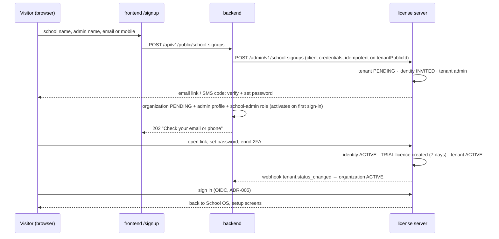

# ADR-007: Self-service school sign-up with a free trial

**Status:** Accepted (owner, 2026-09-30), including defaults D1–D8 ·
**Date:** 2026-09-30 · **Amends:** `SOS_DATABASE_DESIGN.md` §3.1 and §4.7 (owner's document, not edited here), ADR-005

## Context
- `SOS_DATABASE_DESIGN.md` has no public sign-up: a school is created by platform staff (§3.1 `onboarded_by`, status
  PENDING until the invited first admin finishes setup), and "invitations are the only way an account gets attached to a
  school" (§4.7).
- ADR-005: the license server owns identities, tenants (schools) and licenses; the backend never handles passwords.
- **Owner decisions (2026-09-30):**

  | Topic | Decision |
  |---|---|
  | Self-service sign-up | Yes — a public "start a free trial" page |
  | Where the form lives | School OS frontend (not the license server) |
  | Activation | Trial starts automatically once the admin confirms their email/mobile and sets a password |
  | Trial length | 7 days (editable in the license-server admin UI) |
  | Trial scope | All features; limits 1 branch, 100 students, 20 staff (editable in the admin UI) |
  | Sign-in identifier | Email or mobile + password (no `DNSTSA0001`-style codes) |
  | Plans / licenses management | A small admin UI inside the license server (LS-7) |
  | Parents | Mobile one-time-code sign-in, after LS-3 (LS-8) |

## Decision

1. **Form** — public page `/signup` in the frontend: school name, admin full name, email **or** mobile (at least one).
   No password field; the password is set on the license server's page (ADR-005).
2. **Backend** — `POST /api/v1/public/school-signups`, unauthenticated, Joi-validated, rate-limited. It generates the
   school's `public_id`, then calls the license server.
3. **License server** — `POST /admin/v1/school-signups` (scope `signups:create`), one atomic operation, idempotent on
   `tenantPublicId`: create the tenant (`PENDING`, `signup_source = SELF_SERVICE`), find or create the identity
   (`INVITED`), add it as tenant admin, and send the verification + set-password link (email) or code (SMS). No licence
   exists yet.
4. **Backend, after LS success** — one transaction: organization (`PENDING`, `status_source = SUBSCRIPTION`,
   `onboarded_by = null`), the admin's profile linked by `identity_subject`, and a school-admin role assignment for that
   organization. If this fails, retrying with the same `public_id` is safe because the LS call is idempotent.
5. **Verification** — the admin opens the link (or enters the code), sets a password and enrols 2FA (required for school
   admins, ADR-005). The identity becomes `ACTIVE`, a `TRIAL` licence is created from the trial plan (`starts_on = today`,
   `ends_on = +7 days`), the tenant becomes `ACTIVE`, and the `tenant.status_changed` webhook makes the organization
   `ACTIVE`.
6. **Trial end** — the licence becomes `EXPIRED`, the tenant and organization `INACTIVE`. Only school admins can still
   sign in, and they see the renewal page (ADR-005). Upgrading = platform staff assign a paid plan in the admin UI (no
   payment integration yet).
7. **Limits** — the licence carries `branch_limit = 1`, `student_limit = 100`, `staff_limit = 20`. The backend receives
   them with `license.changed` (and daily reconciliation) and enforces them when a branch, student or staff record is
   created: `403 LICENSE_LIMIT_REACHED`. Existing records are never deleted when a limit is lowered.

### Defaults (accepted by the owner, 2026-09-30)

| # | Default | Reason |
|---|---|---|
| D1 | The public endpoint allows 5 sign-ups per hour per IP | Abuse control on an unauthenticated endpoint |
| D2 | One trial per email/mobile: a contact that already administered a trial school gets "contact us" by email or SMS, not on the page | Stops trial farming without revealing on the page which contacts exist |
| D3 | The page always answers "Check your email or phone to continue", whatever happened | No account enumeration |
| D4 | Unverified sign-ups expire after 7 days (link lifetime): tenant and organization become `CLOSED` by a daily job | No orphan schools |
| D5 | Trial plan grace period = 0 days (paid plans keep their own grace days) | The trial is already the free period |
| D6 | School names need not be unique; the slug gets a numeric suffix (`green-valley-2`) | Two schools may share a name |
| D7 | No CAPTCHA at first; add one (provider to be chosen) if abuse appears | Avoids a new external service now |
| D8 | License-server admin UI access: platform identities with a `can_manage_licenses` flag, 2FA required, every action audited; the seeded platform admin has it | The license server has no roles of its own |

## Alternatives considered
| Option | Why not |
|---|---|
| No self-service (design doc as written) | Owner wants public sign-up |
| Sign-up form hosted by the license server | Owner chose the School OS page; also means two directions of school creation |
| Platform approval before the trial starts | Owner chose automatic start |
| Separate LS calls for tenant, identity, licence | Partial failures leave half-created schools; one idempotent call avoids that |

## Consequences
- **+** Schools can start without platform staff; the same set-password flow as invitations is reused.
- **−** A public, unauthenticated write endpoint: rate limits, verification and no-enumeration responses are required
  (D1–D3).
- **−** Two services write for one sign-up: the LS call is idempotent and a cleanup job closes unverified sign-ups (D4).
- **−** Mobile sign-up needs SMS delivery. Owner decision 2026-09-30: the app runs locally for now, so SMS codes (and
  emailed links) go to the license server's local **dev inbox** (`/dev/inbox`); real SMS via **Twilio** is the last
  stage of the last phase (12.4).
- **−** The design doc needs `organizations.signup_source` (`PLATFORM | SELF_SERVICE`) and a nullable `onboarded_by`;
  proposed for sub-phase 2.1, pending the owner's annotation of the design doc.
- Roadmap: LS-4 (trial plan), LS-5 (`school-signups` endpoint), LS-7 (admin UI), backend 5.16 (public endpoint + limit
  enforcement), frontend 6.18 (sign-up page — mockup + approval first). See `implementation-plan.md`.
- Behaviour scenarios: [`docs/bdd/school-signup.md`](../bdd/school-signup.md).
