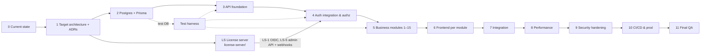

# School OS — Implementation Plan (Phases & Sub-phases)

> Built from `current-state.md`, `feature-audit.md`, `target-architecture.md`, `SOS_DATABASE_DESIGN.md` (schema source
> of truth) and `EXECUTION_ORDER.md` (module order, rebased onto Prisma).
>
> ✅ Implemented · 🟡 Partial · 🔴 Not implemented · 🔄 Refactor required · ⏸ Needs a decision
>
> Every sub-phase follows: Analyse → Plan → BDD → PICT → Test plan → (UI mockup + approval) → TDD → Implement →
> Test → Review → Document. Each ends with the completion report in master prompt §49.

## Dependency overview

Phases 5 and 6 interleave per module (BE then FE for the same module), as EXECUTION_ORDER.md requires.
The license server (Phase LS) is built in the `license-server/` folder in parallel with Phases 2–3.

---

## Phase 0 — Current-state analysis — 🟡 (this deliverable, awaiting review)
| # | Sub-phase | Status |
|---|---|---|
| 0.1–0.11 | Repository, technology, architecture, features, DB, API, UI, testing, security, performance, CI/CD audits | ✅ written to `current-state.md`, `feature-audit.md` |
| 0.12 | Answer open questions (`current-state.md` §19) | 🟡 partly answered 2026-09-30 (see end of file) |

## Phase 1 — Target architecture — 🟡
| # | Sub-phase | Status |
|---|---|---|
| 1.1–1.11 | Target architecture, module boundaries, API, DB, Prisma, auth, authz, errors, logging, observability, security baseline | 🟡 proposed in `target-architecture.md` |
| 1.12 | ADR-001…005 approval | ⏸ owner |

## Phase 1.5 — Security hot-fixes on the current code — ❌ dropped (2026-09-30)
Owner confirmed `dev` is not deployed anywhere. The defects are fixed in the rewrite instead, where the code is
replaced anyway:
| Defect | Fixed in |
|---|---|
| JWT `expiresIn` units (`src/config/appConfig.ts:134-135`, `src/helpers/token.ts:9`) | Removed with in-app JWT signing (LS-1, 4.1) |
| Creating/granting `primary` roles (`role.service.ts:27-48`, `userRole.service.ts:45-50`) | 4.4 delegation ceiling |
| Mass assignment of `organizationId`/`classId` (`branch.service.ts:28` etc.) | 3.2 validation + each Phase 5 module |
| CSRF not mounted (`csrf.middleware.ts`) | 4.1 BFF session + 6.0 FE header |

## Phase LS — License server (folder `license-server/`, ADR-005) — 🔴
Owns identity, sessions, 2FA, tenants and licenses. Detailed docs in [license-server/docs/](../../license-server/README.md).
| # | Sub-phase | Status |
|---|---|---|
| LS-0 | Scaffold: Node 24 + TS (ESM), Express, Prisma, Postgres (own DB), Vitest, docker-compose; ESM/CJS spike for the BE client libraries | 🔴 |
| LS-1 | Identity schema + OIDC core (`oidc-provider`: code + PKCE, resource indicator `school-os-api`, JWKS, refresh rotation, end-session) with the `school-os-backend` client registered | 🔴 **first LS sub-phase** — spec: [LS-1](../../license-server/docs/phases/LS-1-identity-and-oidc.md) |
| LS-2 | Hosted UI: login, logout, consent-free first-party flow — **mockup + approval gate** | 🔴 |
| LS-3 | Password policy, lockout, forgot/reset, 2FA (TOTP) for platform users and school admins | 🔴 |
| LS-4 | Tenants, plans, tenant licenses, entitlements (design §9 moved here); sign-in blocked for inactive tenants | 🔴 |
| LS-5 | Admin API (client credentials): provision identity, tenant users, tenant/license status; HMAC webhooks with retries | 🔴 |
| LS-6 | Hardening: rate limits, audit, key rotation runbook, backups | 🔴 |

## Phase 2 — PostgreSQL + Prisma — 🔴
| # | Sub-phase | Tables (design §) | Status |
|---|---|---|---|
| 2.0 | Tooling: docker-compose Postgres, Prisma install, `src/lib/prisma.ts`, test-DB guard, Vitest harness | — | 🔴 |
| **2.1** | **Profile, RBAC & tenancy schema + seed** | users (profile only, ADR-005), roles, permissions, role_has_permissions, user_has_roles, user_has_permissions, organizations, branches, organization_social_links, audit_logs (§3–4) | 🔴 **first BE sub-phase** — spec: `phases/2.1-prisma-foundation.md` |
| 2.2 | Access workflow tables | invitations, support_sessions (§4.7–4.8), BFF `sessions` | 🔴 |
| 2.3 | People | designations, departments, staff, staff_branch_assignments, students, guardians, student_guardians (§5) | 🔴 |
| 2.4 | Academics | academic_years, grade_levels, classes, sections, subjects, class_subjects, enrollments, teaching_assignments (§6–7) | 🔴 |
| 2.5 | Examination | exams, exam_subjects, marks, mark_corrections (§8) | 🔴 |
| 2.6 | Constraint SQL (partial uniques, CHECKs) + isolation integration tests | all | 🔴 |
| 2.7 | Data migration MySQL → Postgres | only if real data exists | ⏸ (dev not deployed; likely not needed — confirm no shared DB holds data) |
| 2.8 | Remove Sequelize, mysql2, sequelize-cli, `sync({alter})`, bcrypt, passport, `user_oauth_accounts` | — | 🔴 after Phase 5 |

## Phase 3 — API foundation — 🔴
| # | Sub-phase | Status |
|---|---|---|
| 3.1 | Error model + Prisma error mapping (replace Mongo error map) | 🔄 |
| 3.2 | Validation: Joi on body/params/query for every route, `stripUnknown` | 🟡 (auth/users only) |
| 3.3 | Pagination/filter/sort helper + `meta` | 🔴 |
| 3.4 | Request id, JSON logging, `/ready` | 🔴 |
| 3.5 | helmet, CORS tightening, mount unused limiters | 🟡 |
| 3.6 | OpenAPI contract generation + contract test | 🟡 |
| 3.7 | `/api/v1` prefix with `/api` alias | 🔴 |

## Phase 4 — Authentication integration & authorization — 🔄 (depends on LS-1, LS-5)
| # | Sub-phase | Status |
|---|---|---|
| 4.1 | BFF: `/api/v1/auth/login`, `/callback`, `/logout`, `/me`; server-side sessions; JWKS verification; CSRF mounted. Replaces in-app login/refresh/JWT signing | 🔄 |
| 4.2 | Remove register, forgot/reset, bcrypt, passport, Google/Microsoft OAuth, OTP helpers, `resetPasswords.ts` | 🔄 remove |
| 4.3 | Scoped `authorize()` + `ScopeContext` (ADR-003) | 🔄 |
| 4.4 | IAM endpoints on Prisma: delegation ceiling, transactional sync, scoped assignments, audit log | 🔄 |
| 4.5 | Platform namespace + support sessions | 🔴 |
| 4.6 | License webhooks → `organizations.status`; daily reconciliation job | 🔴 |
| 4.7 | ~~OAuth~~ — not required (owner, 2026-09-30); removed in 4.2 | ❌ |
| 4.8 | FE: redirect login, sign-out, CSRF header, route guards, 403 page (fixes B4) | 🔄 UI → mockup gate for guards/403 page |

## Phase 5 — Business modules (EXECUTION_ORDER.md, on Prisma)
Each module = BE (schema → service → controller → route, with tests) then its FE sub-phase in Phase 6.
| # | Module | BE status today | Depends on |
|---|---|---|---|
| 5.1 | Organization management (status lifecycle, social links) | 🟡🔄 | 2.1, 4.3 |
| 5.2 | Branch management (default branch, status) | 🟡🔄 | 5.1 |
| 5.3 | Departments & designations | 🟡 / 🔴 | 2.3 |
| 5.4 | Staff + branch assignments | 🟡🔄 | 5.2, 5.3 |
| 5.5 | Guardians | 🔴 | 2.3 |
| 5.6 | Students + guardian links | 🟡🔄 | 5.2, 5.5 |
| 5.7 | Invitations (identity provisioned via LS admin API; set-password page hosted by LS) | 🔴 | 2.2, LS-5, 5.4–5.6 |
| 5.8 | Academic years | 🟡 | 2.4 |
| 5.9 | Grade levels | 🔴 | 2.4 |
| 5.10 | Classes & sections | 🟡🔄 | 5.2, 5.8, 5.9 |
| 5.11 | Subjects & class subjects | 🟡 | 5.10 |
| 5.12 | Teaching assignments | 🟡🔄 | 5.4, 5.11 |
| 5.13 | Enrollments | 🟡🔄 | 5.6, 5.10 |
| 5.14 | Exams & exam subjects | 🟡 | 5.11, 2.5 |
| 5.15 | Marks, publication & corrections | 🟡🔄 / 🔴 | 5.13, 5.14 |

## Phase 6 — Frontend (per module, after each Phase 5 module)
Every UI sub-phase: requirements → responsive mockup → **owner approval** → BDD → tests → implement → Playwright.
| # | Sub-phase | Status |
|---|---|---|
| 6.0 | FE foundation: shared types, PATCH/CSRF in axios, `RequirePermission`, `errorElement`, org switcher, fix `.env.example`, remove dead files | 🔄 |
| 6.1–6.15 | Screens for modules 5.1–5.15 (EXECUTION_ORDER frontend lists) | 🟡 / 🔴 |
| 6.16 | Dashboard on real data (replace mock) | 🔴 |
| 6.17 | Header/user menu, sidebar routes (fix 8 dead links or hide) | 🔴 |

## Phase 7 — Integration — 🔴
End-to-end journeys: onboard school → first admin invited → branches → staff/students → year/classes → enrollment →
exam → marks → publish → correction. Cross-school isolation journeys.

## Phase 8 — Performance — 🔴
Baseline measurements, then budgets from `target-architecture.md` §8. Dashboard bundle, list pagination, authz query count.

## Phase 9 — Security hardening — 🔴
Authz review with PICT isolation suite, upload allowlist, dependency + secret scanning, prod config review.

## Phase 10 — CI/CD & production readiness — 🔴
GitHub Actions gates, Dockerfiles, docker-compose, migration deploy step with backup, health checks, monitoring.
Hosting target ⏸ owner.

## Phase 11 — Final QA — 🔴
Full suite: unit, integration, API, contract, PICT, Playwright (browser matrix), regression, security, performance.

---

## Owner decisions

**Answered 2026-09-30**
| # | Question | Answer | Effect |
|---|---|---|---|
| 1 | Is `dev` deployed beyond local? | No | Phase 1.5 dropped |
| 2 | Google/Microsoft sign-in? | Not needed | OAuth removed (4.2) |
| 3 | Authentication approach | Custom license server, separate app, identity + licenses, OIDC via `oidc-provider`, School OS only | ADR-005, Phase LS |
| 4 | Repositories | ~~FE, BE and license server are separate repos; docs split per repo~~ — **superseded by #5** | cross-cutting ADRs stay in `backend/docs/` |
| 5 | Repositories (revised) | One repository `subashrs31/School-OS` with folders `backend/`, `frontend/`, `license-server/`; fresh history | ADR-006 |

**Still open**
1. Does any shared MySQL database hold data that must be kept? (Phase 2.7; likely no)
2. Login identifier in the license server: email and mobile only, or also keep the current uuid-style codes
   (e.g. `DNSTSA0001`)? (LS-1)
3. Hosting target (Phase 10).
4. Approve ADR-001…005 and the dependencies they list.
