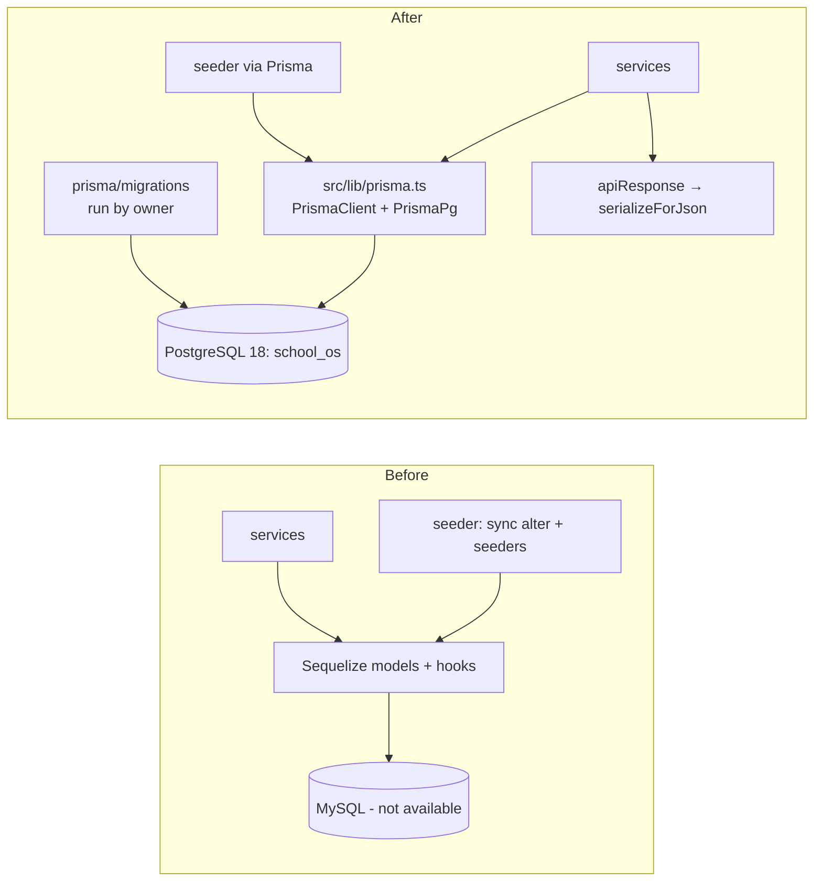

# 2.0-P — Port the backend from MySQL/Sequelize to PostgreSQL/Prisma (as-is)

**Status:** Implemented 2026-09-30 · **Type:** Refactor / infrastructure (no intended behaviour change)
**Decision records:** ADR-001 (PostgreSQL), ADR-002 (Prisma). **Rules:** [prisma-migrations.md](../prisma-migrations.md)

## 1. Why
The backend could not run: it needed MySQL, and the owner has no MySQL for this project. The owner chose to remove MySQL
now and **port the existing data layer as-is** to PostgreSQL + Prisma, so the app runs again with the same API, before
evolving to the SOS_DATABASE_DESIGN schema through normal migrations (2.1 onwards).

## 2. Before / after

| Area | Before | After |
|---|---|---|
| Database | MySQL (unavailable) | PostgreSQL 18.4 local: `school_os`, `school_os_test` |
| ORM | Sequelize 6, 27 models, associations in `src/models/index.ts` | Prisma 7.10 client (`prisma/schema.prisma`, generated to `src/generated/prisma`, gitignored, `postinstall: prisma generate`) |
| Schema source | two sequelize-cli migrations **and** `sync({ alter: true })` | one Prisma migration `20260929200833_init_port_from_mysql` |
| Tables | 27 | 26 (`user_oauth_accounts` not ported — OAuth removed) |
| Tests | none | 236 (unit, integration, API contract) |
| OAuth / passport | present, broken, unrouted | removed |

## 3. What changed, file by file

| File | Change |
|---|---|
| `prisma/schema.prisma` | new — table-for-table port; same table/column names, `@@map`, `@db.VarChar(255)`, `@db.Date` for DATEONLY, `@db.Decimal(5,2)`, 10 Postgres enums, same unique/index names, same `onDelete` rules; relation fields named like the Sequelize aliases |
| `prisma.config.ts` | new — Prisma 7 requires it; loads `.env`; datasource URL; seed command |
| `prisma/migrations/…_init_port_from_mysql/`, `migration_lock.toml` | new — generated |
| `src/lib/prisma.ts` | new — client singleton with `PrismaPg` adapter (required in Prisma 7) |
| `src/helpers/modelData.ts` | new — keeps only real columns from request bodies and coerces types (see §4) |
| `src/helpers/serialize.ts` + `apiResponse.ts` | new/changed — date-only → `YYYY-MM-DD`, Decimal → `"80.00"` for every success response |
| `src/services/*.service.ts` (13), `controllers/auth.controller.ts` (`/me`), `queue/Queue.ts`, `schedule/cronRunner.ts` | Sequelize calls → Prisma, same signatures and returns |
| `src/database/seeder.ts`, `seeders/*.ts`, `resetPasswords.ts` | Prisma; `TRUNCATE … RESTART IDENTITY CASCADE` replaces `SET FOREIGN_KEY_CHECKS`; `sync({alter})` removed |
| `src/config/appConfig.ts` | `DATABASE_URL` (required, postgres URL) replaces `DB_*`; OAuth vars removed |
| `src/config/db.ts` | `connectDB()` = `SELECT 1` via Prisma |
| `src/types/index.ts` | `Express.Request.user` declared locally (was provided by `@types/passport`); `OAuthProfile` removed |
| `src/app.ts` | passport init removed |
| `src/helpers/token.ts` | unused import removed — it broke `tsc` (`noUnusedLocals`) before this change |
| removed | `src/models/`, `src/database/migrations/`, `src/config/{sequelize.ts,sequelize.config.js,passport.ts,oauthConfig.ts}`, `src/services/oauth.service.ts`, `.sequelizerc`, OAuth handler in `auth.controller.ts` |
| `package.json` | + `@prisma/client`, `@prisma/adapter-pg`, `pg`; dev + `prisma`, `vitest`, `supertest`, `@types/supertest`; − `sequelize`, `sequelize-cli`, `mysql2`, `passport*`, `@types/passport`; scripts `test*`, `prisma:*`, `db:*`; `migrate*` (sequelize-cli) removed |
| `.env.example`, `.gitignore` | Postgres URLs; `src/generated/` ignored |
| `test/**`, `vitest.config.ts` | new |

## 4. Decisions that are not obvious from the diff

1. **Relation field names copy the Sequelize aliases** (`Staff.User`, `Staff.Designation`, `Class.Sections`,
   `Student.StudentAcademicEnrollments`, `Mark.enteredByUser` …) because API responses expose them and the frontend reads
   `staff.User`, `staff.Designation`, `class.Sections`.
2. **Response serialiser instead of a Prisma `result` extension.** Prisma returns `@db.Date` as a JS `Date`
   (`…T00:00:00.000Z`); Sequelize returned `"YYYY-MM-DD"`. The Prisma docs do not say a `result` extension can override
   an existing field and state it does not apply to relations, so a serialiser in `apiResponse.success` formats the six
   date-only field names (used only by date-only columns) and Decimals (`toFixed(2)`, like mysql2).
3. **`modelData()` for request bodies.** Sequelize `create/update` ignored unknown keys and coerced `"4"` → 4; Prisma
   rejects both. Field lists come from Prisma's public `<Model>ScalarFieldEnum`; types from naming conventions
   (`*Id` Int, `is*` Boolean, `*At`/date names DateTime), enforced by a unit test that parses `schema.prisma`
   (the generated client's runtime data model is internal API, so it is not relied on). `id`, `createdAt`, `updatedAt`
   are never taken from the body. Mass assignment of other columns (e.g. `organizationId`) is **kept as-is** — fixed in
   Phases 3–4.
4. **Case-insensitive login/reset lookups** (`mode: 'insensitive'`) reproduce MySQL's default collation for user-typed
   email/uuid. Other string comparisons are now case-sensitive (PostgreSQL default).
5. **Password hashing moved from model hooks into the services**; the model's default `'12345678'` for users created
   without a password is **kept** (known issue, Phase 4).
6. **Where Sequelize and Prisma genuinely differ, the evident intent was implemented** and recorded here:
   - `authorization.service`: Sequelize's spread of a scope `Op.or` silently replaced the expiry `Op.or`; no caller passes
     a scope, so both conditions are now combined with AND.
   - `permission.service.updatePermission`: Prisma ignores `undefined` filters (Sequelize threw), which would have made
     the duplicate check match every other permission; the stored `resource`/`action` are used as fallbacks.
7. **Known pre-existing defects deliberately preserved** (not in scope): `register`/`importUsers` create users without
   a `uuid` (B7) and fail; `assignClassSubject` lets the body override `classId`; no transactions; JS-side role filtering
   in `getUsers`.

## 5. Verification

| Check | Result |
|---|---|
| `prisma validate` | valid |
| Generated SQL vs Sequelize migrations | 26/27 tables (oauth excluded); 59/60 FKs (43 cascade, 16 set-null; the missing one is on the oauth table); 15 unique indexes with the same names; 22/23 plain indexes (oauth index excluded); 12 `DATE`, 3 `DECIMAL(5,2)` — all match |
| `tsc --noEmit`, `npm run build` | pass (the build was already failing before this change, see `token.ts`) |
| `npm test` | **236 passed** — 5 guard, 5 serialiser, 6 + ~200 `modelData`/schema-convention, 7 authorization/seed integration, 15 API contract |
| Red → green evidence | guard + serialiser + modelData tests failed first on missing modules; integration/API tests failed with `The table public.roles does not exist` before the migration; 2 API tests then failed with 422 because the backend's Joi email rule rejects `.test` domains — test data changed to `example.com` |
| `npm run seed:all` ×2 | 7 roles, 88 permissions, 2 users, 21 role-permissions; second run created nothing |
| Running app | `npm run dev` → `PostgreSQL connected successfully`; `GET /api/health` 200; login as superadmin 200; `/api/auth/me` 200 with the expected shape; `/api/organizations` 200; frontend on :5173 serves and targets `http://localhost:8000/api/`; CORS preflight from :5173 200 |
| Manual UI walk-through in the browser | **not done by the assistant** — owner to confirm (known bugs B1, B4, B12 unchanged) |

## 6. Migration execution (recorded exception)
Per CLAUDE.md §20 the owner runs migrations. For this initial migration the owner granted a **one-time exception**:
the assistant ran `npx prisma migrate dev --name init_port_from_mysql` (dev DB). `npm run db:test:reset`
(`migrate reset --force`) was blocked by Prisma's AI-agent safety check; the owner chose the non-destructive
`prisma migrate deploy` against `school_os_test` instead (now `npm run db:test:migrate`). All later migrations are
owner-run.

## 7. Corrections to earlier plans
- A Docker PostgreSQL 16 container was planned; the owner already runs PostgreSQL 18.4 locally, so the compose files
  were created and then removed, and all docs now say PostgreSQL 18.
- ADR-002's "module by module, Sequelize and Prisma coexist" plan was superseded by this one-step port.
- The plan assumed a `prisma/seed.ts`; the existing seeder was ported instead and configured as the Prisma seed command.

## 8. Risks, rollback
- **Risk:** a response-shape difference not covered by the 15 contract tests (e.g. rarely used endpoints: marks,
  teacher assignments, user import). Mitigation: owner walk-through; add a contract test when a difference is found.
- **Risk:** Decimal values now always have two decimals (`"80.00"`) — matches mysql2; `Number()` on the client is unaffected.
- **Rollback:** revert the commit; the owner drops/recreates `school_os` / `school_os_test`. There is no MySQL to fall back to.

## 9. Out of scope (follow-ups)
SOS_DATABASE_DESIGN schema (2.1+), transactions, tenant scoping and mass-assignment fixes (Phases 3–4), removing
in-app passwords/JWT (Phase 4 with the license server), CI running migrations on an empty database (Phase 10),
Playwright/BDD UI coverage (to be offered separately).

## 10. Non-technical summary
The school system's server could not start because it was built for a database (MySQL) that isn't available. We moved
it to PostgreSQL, the database the project is standardising on, using a modern data toolkit (Prisma). Nothing the
screens rely on was meant to change: the same data, the same answers from the server. It was checked with 236
automated tests, a real login, and the main data screens' API calls. The app now starts and connects to PostgreSQL.
A person still needs to click through the screens once to confirm.
