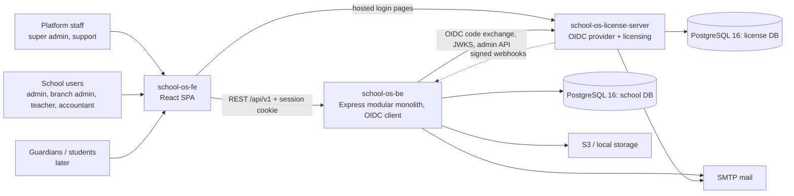
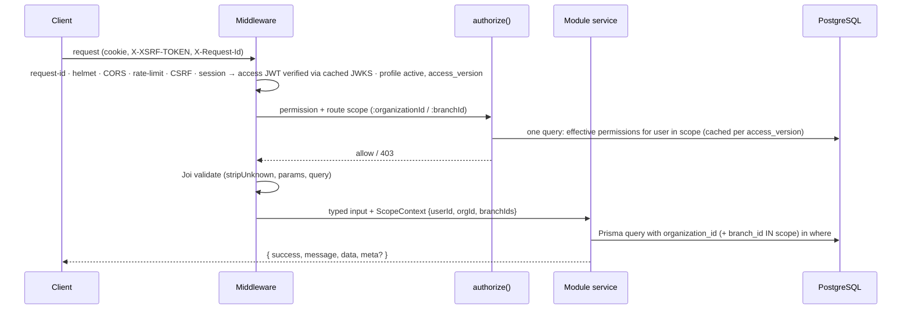
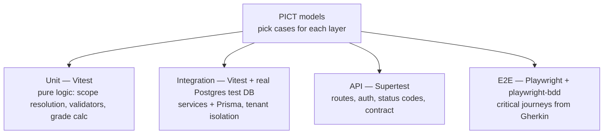
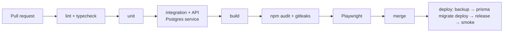

# School OS — Target Architecture (Proposed)

> Status: **Proposed — awaiting approval.** Decisions are recorded as ADRs in `docs/architecture/`.
> Schema source of truth: `SOS_DATABASE_DESIGN.md`. Current state: `current-state.md`.

## 1. Principles

1. **Modular monolith + one identity service.** One deployable school API, one SPA, and a separate
   **license server** for identity and licensing (ADR-005). No further service split: one team, no independent
   scaling need (revisit only with evidence).
2. **Tenant isolation in the database and in one place in code.** `organization_id` (and `branch_id`) on every
   school-owned row, composite pair-FKs, and a single authorization/scoping function every route uses.
3. **Filter at the source.** Scope, status and date predicates live in the Prisma `where`; lists are paginated;
   responses `select` only rendered columns.
4. **One role → one endpoint namespace → one screen** where roles differ (platform vs school vs parent).
5. **Incremental migration.** Module by module, with tests written first; nothing big-bang.
6. **Keep what works.** Express 4, Joi, winston, TanStack Query, Redux (auth only), shadcn UI stay.

## 2. System context



Repositories: `school-os-fe`, `school-os-be` (this repo; cross-cutting ADRs live here), `school-os-license-server`.

## 3. Backend

### 3.1 Module layout (incremental)

```text
src/
├── app.ts, server.ts
├── lib/                 prisma.ts (client singleton), logger, request-context
├── middleware/          auth, authorize, validate, request-id, error, csrf
├── modules/
│   ├── auth/            OIDC client (login redirect, callback, logout, session), token verification, license webhooks
│   ├── iam/             roles, permissions, assignments
│   ├── organizations/   organizations, branches, social links, status
│   ├── people/          staff, designations, departments, guardians, students
│   ├── academics/       years, grade levels, classes, sections, subjects, class subjects, enrollments, teaching
│   ├── exams/           exams, exam subjects, marks, corrections
│   ├── invitations/
│   └── audit/
└── shared/              errors, pagination, api-response
```

A module owns its routes, validation, service and tests. Modules call each other only through exported service
functions, never through another module's Prisma queries. Existing `src/routes|controllers|services` move into
`modules/` **as each module is rewritten on Prisma** — no standalone reshuffle.

### 3.2 Request pipeline



### 3.3 API conventions

| Topic | Rule |
|---|---|
| Base path | `/api/v1` (current `/api` kept as alias until the FE switches) |
| Platform vs school | `/api/v1/platform/...` for platform-plane operations (onboarding, org status, support sessions); `/api/v1/organizations/:orgId/...` for school operations |
| Methods | `GET` read, `POST` create/command, `PATCH` partial update, `DELETE` only where design allows; status changes as explicit commands (`PATCH /:id/status`) |
| Validation | Joi for body, params and query on **every** route; `stripUnknown: true`; `organizationId` never accepted from the body |
| Lists | `?page&pageSize(≤100)&sort&order&q&status…`; response `meta: { page, pageSize, total }` |
| Errors | `{ success:false, message, code, errors?[] }`; Prisma `P2002` → 409, `P2025` → 404, `P2003` → 409; no raw 500 messages |
| Concurrency | `row_version` sent on update; mismatch → 409 |
| IDs | internal `id` for API paths inside the app; `public_id` for anything exposed outside (URLs shared by email, downloads) |
| Bulk | only where the operation is naturally batch (marks entry per exam-subject, role-permission sync, CSV import) |
| Contract | OpenAPI 3 annotations per route; `docs/api/openapi.yaml` generated and checked in CI |

### 3.4 Data layer — PostgreSQL + Prisma (ADR-001, ADR-002)

- Prisma schema in `prisma/schema.prisma`, `snake_case` tables/columns via `@@map`/`@map`, camelCase in code.
- Enums as Postgres enums; values follow the design doc (UPPERCASE) — exception: `role_type` and `scope_type` keep
  the existing lowercase values, as the design doc states.
- Pair-FKs: each school table declares `@@unique([organizationId, id])`; children reference
  `(organizationId, parentId)` so cross-school links are rejected by Postgres.
- Rules Prisma cannot express (partial unique indexes such as "one current academic year per school", "one default
  branch", CHECK constraints like `pass_marks <= max_marks`) are added as raw SQL in the generated migration file.
- Every multi-write operation runs in `prisma.$transaction`.
- Migrations: generated by Prisma, reviewed in PR, **executed manually by the project owner** (dev) and by the
  pipeline's deploy step (staging/prod) after backup.
- Seeds: `prisma/seed.ts` — permissions, roles, role mappings (design §11), and one platform super-admin **profile**
  linked by `identity_subject` to an identity created in the license server (no password in this database).

### 3.5 Authentication — delegated to the license server (ADR-005, Phase 4)

- school-os-be is an **OIDC confidential client / BFF** (`openid-client`): `GET /api/v1/auth/login` → redirect to the
  license server with code + PKCE + state; `GET /api/v1/auth/callback` exchanges the code; `POST /api/v1/auth/logout` ends the
  local session and redirects to the license server's end-session endpoint.
- Tokens stay server-side, in a `sessions` table (encrypted refresh token, expiry). The browser gets an HttpOnly,
  `SameSite=Lax` session cookie plus the `XSRF-TOKEN` cookie; CSRF double-submit is mounted on every mutating route.
- Each request: session → access JWT (refreshed with the rotating refresh token when expired) → verified with
  `jose` against the cached JWKS (`iss`, `aud = school-os-api`, `exp`) → local profile looked up by `identity_subject`
  → rejected if the profile is inactive or its `access_version` changed.
- Credentials, 2FA, lockout, password reset and sign-in blocking for unlicensed tenants are **license-server**
  responsibilities. school-os-be has no password column and no JWT signing key.
- `POST /api/v1/auth/license-events` receives HMAC-signed, idempotent webhooks and updates `organizations.status`
  (`status_source = SUBSCRIPTION`) with an `audit_logs` row. A daily job reconciles tenant status.
- Removed: register, forgot/reset, bcrypt, passport, Google/Microsoft OAuth, `user_oauth_accounts`, `resetPasswords.ts`.

### 3.6 Authorization & tenant scoping (ADR-003)

- Effective permission = role permissions for active, unexpired, unrevoked assignments whose scope covers the request
  (global ⊇ organization ⊇ branch), plus direct allows, minus direct denies.
- `primary` bypasses checks; `secondary` must still hold the permission and must use a `support_session` to act
  inside a school.
- Delegation ceiling: a user can grant only roles/permissions they hold themselves, at or below their own scope;
  `primary` roles can be granted only by `primary`.
- The `ScopeContext` produced by `authorize()` is the only source of `organizationId`/`branchIds` in services.
- `user_organizations` is retired; membership is derived from role assignments and person records (design §0).
- Users are identified by `identity_subject` (license-server `sub`). Whether a person may sign in to a tenant is
  decided by the license server; what they may do inside it is decided here.

### 3.7 Background work

Wire the existing queue after Prisma: job persistence in `jobs`/`failed_jobs`, pending jobs reloaded at startup,
listeners registered in `bootstrap.ts`. Outbox pattern (design §9.3) later.

## 4. Frontend and license server

- Frontend target architecture: `school-os-fe/docs/target-architecture.md`. Contract points owned by this repo:
  login is a redirect to `/api/v1/auth/login`; updates use `PATCH`; mutating requests send `X-XSRF-TOKEN`; lists use the
  pagination contract in §3.3.
- License server architecture, data model and API: `school-os-license-server/docs/`.

## 5. Testing architecture (ADR-004)



- Test DB: Postgres in docker-compose (`TEST_DATABASE_URL`), schema applied with `prisma migrate reset --force` by the
  test script only against the test database; each test file uses a transaction or truncates its own tables.
- Deterministic fixtures: platform super admin, school admin, branch admin, teacher, inactive user, two schools with
  two branches each (for isolation tests).
- Playwright: Chromium on every PR; Firefox + WebKit + one mobile viewport nightly; saved auth state for non-auth specs.

## 6. Observability

- `X-Request-Id` middleware; winston JSON format with `requestId`, `userId`, `organizationId`; no secrets/PII.
- `/api/health` (liveness, no DB) and `/api/ready` (DB ping).
- Metrics (request count, error rate, p95 latency, auth failures) via `prom-client` — Phase 10, subject to approval.

## 7. Security baseline

helmet · strict CORS allowlist in every env except local · rate limits · CSRF · Joi everywhere · no passwords stored
in the school DB · JWT verified against JWKS with `iss`/`aud`/`exp` · encrypted server-side refresh tokens · HMAC-signed,
idempotent license webhooks · upload allowlist + magic bytes + authenticated downloads · `npm audit` + gitleaks in CI ·
audit log for every grant, status change and correction. Credential security (hashing, lockout, 2FA, reset) is
specified in the license-server docs.

## 8. Performance budgets (initial — measure baseline in Phase 8 and adjust)

| Metric | Budget |
|---|---|
| API p95 (list, 25 rows) | ≤ 200 ms on test hardware |
| Authorized request DB round trips | ≤ 3 |
| List response size (25 rows) | ≤ 50 KB |
| FE initial JS (gzip, login route) | ≤ 250 KB |
| FE LCP (dashboard, desktop, local API) | ≤ 2.5 s |
| Network requests on page load | ≤ 6 API calls |

## 9. Deployment (Phase 10)

Dockerfile per repo, docker-compose for local (web + api + license server + two Postgres databases). `dev` is not
deployed anywhere today (owner, 2026-09-30). Target hosting is **UNKNOWN — REQUIRES CONFIRMATION**; pipeline design
waits on that answer.



## 10. Before → after summary

| Area | Before | After |
|---|---|---|
| DB / ORM | MySQL + Sequelize, sync + migrations | PostgreSQL + Prisma migrations only |
| Tenant isolation | per-service `organizationId`, several gaps | pair-FKs in DB + single `ScopeContext` |
| Authentication | in-app passwords + self-signed JWT, broken OAuth | OIDC via license server; BFF session; no passwords here |
| Licensing | none | license server drives `organizations.status` |
| Authorization | global scope only works; escalation possible | scoped effective permissions + delegation ceiling |
| Validation | auth/users only | every route |
| Tests / CI | none | unit, integration, API, BDD E2E, CI gates |
| Observability | text logs | request ids, JSON logs, health/ready, metrics |
