# School OS — Roadmap, phases and workflow map

> One document for the whole system: the School OS **frontend**, the School OS **backend** and the **license server**.
> It lists every phase in detail and maps every workflow step by step — who does what, on which screen, and which
> frontend code, backend endpoint, license-server endpoint and tables are involved.
>
> **Open [`system-map.html`](system-map.html) in a browser** for the clickable version: the same flows with a mock
> screen at every step, all screens linked to each other, and a map of the system.
>
> This is the complete, detailed version of the phase list in
> [`backend/docs/implementation-plan.md`](../backend/docs/implementation-plan.md). Written 2026-09-30 from that plan, the
> target architecture, ADR-001…007, the license-server documents and the code on `main` (`bf11558`). Nothing here is
> invented: anything the specs don't settle is marked **[DECIDE]** (a decision for you) or “set in the sub-phase spec”.

**Legend** — ✅ done · 🟡 partly done · 🔴 not started · 🔄 exists today but must be rebuilt · ➡ moved · ❌ dropped ·
**Built** = works in the code today · **Proposal** = a screen drawn from the specs, approved in its phase ·
sample data uses **2 Oct 2026** as “today”.

## Contents

1. [The system in one picture](#1-the-system-in-one-picture)
2. [Build order](#2-build-order)
3. [Every phase in detail](#3-every-phase-in-detail)
4. [Workflow map](#4-workflow-map)
5. [Module map](#5-module-map)
6. [Known issues in today's code](#6-known-issues-in-todays-code)
7. [Decisions and open questions](#7-decisions-and-open-questions)

---

## 1. The system in one picture

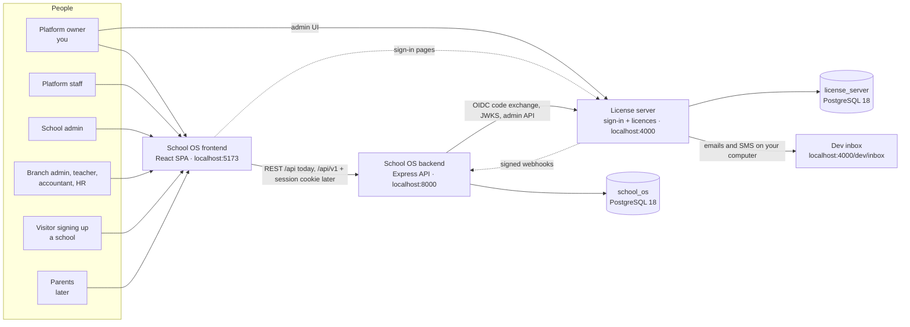

| App | Folder | Runs at | Owns |
|---|---|---|---|
| School OS frontend | `frontend/` | `localhost:5173` | All school screens. Today it has its own login form; after Phase 4 it has none. |
| School OS backend | `backend/` | `localhost:8000` (`/api`, later `/api/v1`) | Schools, branches, people, academics, exams, roles and permissions (RBAC), the school database. After Phase 4 it stores **no passwords**. |
| License server | `license-server/` | `localhost:4000` (`PORT` in `.env.example`) | Sign-in (email or mobile + password, two-step), sessions, schools as *tenants*, plans and licences, its own admin UI, the local dev inbox. Built in the LS track. |
| School database | — | PostgreSQL 18 `school_os` (+ `school_os_test`) | 27 tables today (see §5). |
| License database | — | PostgreSQL 18 `license_server` (+ `license_server_test`) | 14 tables (`license-server/docs/data-model.md`). |

**Who is who**

| Person | Signs in to | Account plane | Role in School OS (seeded) | Two-step |
|---|---|---|---|---|
| Platform owner (you) | License-server admin UI and School OS | PLATFORM | `super-admin` (primary: bypasses every permission check) | required |
| Platform staff | School OS; the admin UI only with “can manage licences” | PLATFORM | `admin` (secondary: needs each permission; acts inside a school only through a support session, 4.5) | required |
| School admin | School OS | SCHOOL | `school-admin` (organization scope) | required |
| Branch admin | School OS | SCHOOL | `branch-admin` (branch scope) | not required |
| Teacher, accountant, HR | School OS | SCHOOL | `teacher`, `accountant`, `hr` | not required |
| Parents (later) | School OS | SCHOOL | — | mobile one-time code (12.4) |

Today only `super-admin` can run schools: the seeded `admin` role has IAM permissions only, and the five school roles
have no permissions at all (issue N7, `backend/src/database/seeders/RolePermissionSeeder.ts`).

**What lives where** (ADR-005)

| License server | School OS backend |
|---|---|
| Identities: email, mobile, password hash, two-step, status, lockout | `users` = profile linked by `identity_subject` (the license server's `sub`): name, plane, status, `access_version` |
| Tenants (one per school, same public id as `organizations.public_id`) and `tenant_users` (who may sign in to which school) | Organizations, branches and all school data |
| Plans, features, licences, entitlements | `organizations.status`, driven by licence webhooks; a manual SUSPENDED still wins |
| Sessions, grants, refresh tokens, sign-in audit | Roles, permissions, scoped assignments, delegation ceiling, `audit_logs` |
| Sign-in, two-step, forgot/reset and set-password pages | Invitations |

## 2. Build order

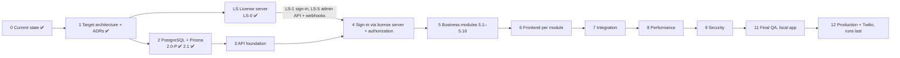

**The order being followed** (owner decisions of 2026-09-30):

| # | Step | Status |
|---|---|---|
| 1 | Phases 0, 1, 2.0-P, 2.1 and LS-0 | ✅ commits `14e16a0`, `d099561`, `96a0ea2`, `bf11558` |
| 2 | This roadmap and `system-map.html` (the mockup for LS-2 and LS-7 review) | ✅ this document |
| 3 | LS track: LS-1 → LS-2 → LS-3 → LS-4 → LS-7 → LS-5 → LS-6 → LS acceptance run | 🔴 next — LS-1 first |
| 4 | Backend: 3.x API foundation → 2.2 → Phase 4 (School OS signs in through the license server) | 🔴 |
| 5 | Modules 5.1–5.16, each followed by its frontend sub-phase 6.n | 🔴 |
| 6 | 7 → 8 → 9 → 11 → 12 (Twilio SMS is the very last stage, 12.4) | 🔴 |

Every sub-phase follows: analyse → plan → BDD → PICT → test plan → (UI mockup + approval) → TDD → implement → test →
review → document. Database migrations are reviewed and **run by you** (or on your explicit instruction), one per data
sub-phase.

---

## 3. Every phase in detail

Overview (details below each table row):

| Phase | Status | Sub-phases |
|---|---|---|
| [Phase 0 — Current-state analysis](#phase-0--current-state-analysis) | 🟡 partly done | 0.1–0.11 ✅ · 0.12 🟡 |
| [Phase 1 — Target architecture](#phase-1--target-architecture) | 🟡 partly done | 1.1–1.11 🟡 · 1.12 ✅ |
| [Phase 1.5 — Security hot-fixes on the old code](#phase-15--security-hot-fixes-on-the-old-code) | ❌ dropped | 1.5 ❌ |
| [Phase LS — License server (`license-server/`, ADR-005)](#phase-ls--license-server-license-server-adr-005) | 🔴 not started | LS-0 ✅ · LS-1 🔴 · LS-2 🔴 · LS-3 🔴 · LS-4 🔴 · LS-5 🔴 · LS-6 🔴 · LS-7 🔴 · LS-8 ➡ · LS-A 🔴 |
| [Phase 2 — PostgreSQL + Prisma](#phase-2--postgresql--prisma) | 🟡 partly done | 2.0 ✅ · 2.0-P ✅ · 2.1 ✅ · 2.2 🔴 · 2.3 🔴 · 2.4 🔴 · 2.5 🔴 · 2.6 🔴 · 2.7 ❌ · 2.8 🟡 |
| [Phase 3 — API foundation](#phase-3--api-foundation) | 🔴 not started | 3.1 🔄 · 3.2 🟡 · 3.3 🔴 · 3.4 🔴 · 3.5 🟡 · 3.6 🟡 · 3.7 🔴 |
| [Phase 4 — Sign-in through the license server, and authorization](#phase-4--sign-in-through-the-license-server-and-authorization) | 🔄 rebuild | 4.1 🔄 · 4.2 🟡 · 4.3 🔄 · 4.4 🔄 · 4.5 🔴 · 4.6 🔴 · 4.7 ❌ · 4.8 🔄 |
| [Phase 5 — Business modules (backend, on Prisma)](#phase-5--business-modules-backend-on-prisma) | 🔴 not started | 5.1 🔄 · 5.2 🔄 · 5.3 🟡 · 5.4 🔄 · 5.5 🔴 · 5.6 🔄 · 5.7 🔴 · 5.8 🟡 · 5.9 🔴 · 5.10 🔄 · 5.11 🟡 · 5.12 🔄 · 5.13 🔄 · 5.14 🟡 · 5.15 🔄 · 5.16 🔴 |
| [Phase 6 — Frontend (one sub-phase after each Phase 5 module)](#phase-6--frontend-one-sub-phase-after-each-phase-5-module) | 🔴 not started | 6.0 🔄 · 6.1–6.15 🟡 · 6.16 🔴 · 6.17 🔴 · 6.18 🔴 |
| [Phase 7 — Integration](#phase-7--integration) | 🔴 not started | 7 🔴 |
| [Phase 8 — Performance](#phase-8--performance) | 🔴 not started | 8 🔴 |
| [Phase 9 — Security hardening](#phase-9--security-hardening) | 🔴 not started | 9 🔴 |
| [Phase 10 — CI/CD and production readiness](#phase-10--cicd-and-production-readiness) | ➡ moved | 10 ➡ |
| [Phase 11 — Final QA (local app)](#phase-11--final-qa-local-app) | 🔴 not started | 11 🔴 |
| [Phase 12 — Production and external services (runs last)](#phase-12--production-and-external-services-runs-last) | 🔴 not started | 12.1 🔴 · 12.2 🔴 · 12.3 🔴 · 12.4 🔴 |

### Phase 0 — Current-state analysis

**Status:** 🟡 partly done

Read-only audit of the code as it was on `origin/dev` before the rewrite.

#### 0.1–0.11 — Audits: repository, technology, architecture, features, database, API, UI, testing, security, performance, CI/CD

- **Status:** ✅ done
- **Delivers:** `backend/docs/current-state.md`, `backend/docs/feature-audit.md`, `frontend/docs/current-state.md`
- **Depends on:** —
- **Done when:** Reports written; every finding tagged as fact or hypothesis.
- **Spec:** the reports themselves

#### 0.12 — Answer the open questions

- **Status:** 🟡 partly done
- **Delivers:** Owner decisions (§7)
- **Depends on:** 0.1–0.11
- **Done when:** Answered 2026-09-30 except hosting (12.2) and the payment provider.
- **Spec:** `backend/docs/implementation-plan.md` (decisions)

### Phase 1 — Target architecture

**Status:** 🟡 partly done

The design every later phase builds on. Decisions are recorded as ADRs.

#### 1.1–1.11 — Target architecture: module boundaries, API conventions, database, Prisma, authentication, authorization, errors, logging, observability, security baseline

- **Status:** 🟡 partly done
- **Delivers:** `backend/docs/target-architecture.md`, `frontend/docs/target-architecture.md`, `license-server/docs/architecture.md`
- **Depends on:** Phase 0
- **Done when:** The documents exist. `target-architecture.md` is still marked “Proposed”; its decisions are accepted through the ADRs.
- **Spec:** those documents

#### 1.12 — ADR approval

- **Status:** ✅ done
- **Delivers:** ADR-001 PostgreSQL · ADR-002 Prisma · ADR-003 tenant scoping and RBAC · ADR-004 testing stack · ADR-005 license server (OIDC) · ADR-006 single repository · ADR-007 self-service sign-up
- **Depends on:** 1.1–1.11
- **Done when:** All accepted by the owner on 2026-09-30 (commit `d099561` for ADR-001…005).
- **Spec:** `backend/docs/architecture/`

### Phase 1.5 — Security hot-fixes on the old code

**Status:** ❌ dropped

Dropped on 2026-09-30: the old `dev` build is not deployed anywhere, so the defects are fixed in the rewrite instead.

#### 1.5 — JWT expiry units · creating/granting primary roles · mass assignment of `organizationId`/`classId` · CSRF not mounted

- **Status:** ❌ dropped
- **Delivers:** Fixed in: LS-1 and 4.1 (JWT) · 4.4 (primary roles) · 3.2 and each Phase 5 module (mass assignment) · 4.1 and 6.0 (CSRF)
- **Depends on:** —
- **Done when:** —
- **Spec:** `backend/docs/implementation-plan.md` Phase 1.5

### Phase LS — License server (`license-server/`, ADR-005)

**Status:** 🔴 not started

A separate app that owns identity, sessions, two-step, schools (tenants) and licences. Owner decision 2026-09-30: build and test the whole license server first, in this order: LS-1 → LS-2 → LS-3 → LS-4 → LS-7 → LS-5 → LS-6 → acceptance run. Each data sub-phase has one migration, which you run (or ask me to run).

#### LS-0 — Scaffold

- **Status:** ✅ done · commit `96a0ea2`
- **Delivers:** Node 24 + TypeScript (ESM), Express 4.22, Vitest + Supertest, `GET /health`; spike proving the backend can load `jose` and `openid-client` without changing its module format
- **Depends on:** ADR-005
- **Done when:** 3 tests pass; spike result recorded in ADR-005.
- **Spec:** `license-server/README.md`

#### LS-1 — Identity + OIDC core (next)

- **Status:** 🔴 not started
- **Delivers:** Tables `users`, `oidc_payloads`, `ls_audit_logs`; `oidc-provider` 9.12.2 with the `school-os-backend` client (code + PKCE S256, resource `school-os-api`, RS256 JWT access tokens for 10 minutes, JWKS, rotating refresh tokens 7 days idle / 30 days absolute, end-session); a plain login form (email or mobile + password); `argon2` 0.45.1; Prisma 7.10; seed of your platform admin
- **Depends on:** LS-0
- **Done when:** The 10 acceptance criteria of the LS-1 spec: discovery lists S256 and RS256 only · no PKCE → `invalid_request` · code exchange returns a JWT with `aud`, `sub`, `plane`, `av`, `exp` · JWKS verification · refresh-token reuse revokes the grant · a raised `access_version` refuses refresh · a disabled identity gets `account_inactive` with an audit row · end-session revokes · codes single-use · idempotent seed with no default password.
- **Spec:** `license-server/docs/phases/LS-1-identity-and-oidc.md`

#### LS-2 — Sign-in pages (mockup approval first)

- **Status:** 🔴 not started
- **Delivers:** Server-rendered pages in the School OS look: sign in, set password, all set, school access inactive, signed out (the two-step, forgot and reset pages follow in LS-3). The screens in `system-map.html` are the mockup for approval.
- **Depends on:** LS-1
- **Done when:** Set in the LS-2 spec; the pages are covered by Playwright (`license-server/docs/architecture.md` §6).
- **Spec:** LS-2 spec (written when it starts)

#### LS-3 — Password rules, lockout, forgot/reset, two-step, dev inbox

- **Status:** 🔴 not started
- **Delivers:** Lockout after 5 failures for 15 min plus IP rate limiting; reset tokens stored as SHA-256 hashes, single use, 15 min, forgot always answers 200; set-password links for 7 days; TOTP two-step for platform staff and school admins (secret encrypted AES-256-GCM, hashed recovery codes); email/SMS verification; tables `user_mfa_factors`, `password_reset_tokens`, `outbound_messages`; the local dev inbox `/dev/inbox` (only when `LS_ENV=local`); SMTP optional through `MAIL_*`
- **Depends on:** LS-1, LS-2
- **Done when:** Set in the LS-3 spec (scenarios in `license-server/docs/bdd/authentication.md`). Password rules: [DECIDE] in LS-3.
- **Spec:** LS-3 spec (written when it starts)

#### LS-4 — Schools, plans, licences

- **Status:** 🔴 not started
- **Delivers:** Tables `tenants`, `tenant_users`, `plans` (seeded 7-day trial: price 0, grace 0, 1 branch / 100 students / 20 staff, all features), `plan_features`, `tenant_licenses`, `tenant_entitlements`; the daily expiry job (TRIAL/ACTIVE/GRACE → school ACTIVE; EXPIRED/CANCELLED → INACTIVE; manual SUSPENDED wins); sign-in refused for inactive schools, school admins let in to renew
- **Depends on:** LS-1
- **Done when:** Set in the LS-4 spec.
- **Spec:** `license-server/docs/data-model.md` §3–4

#### LS-5 — Admin API and webhooks

- **Status:** 🔴 not started
- **Delivers:** `/admin/v1` for the backend only (client credentials; scopes `identities:provision`, `tenants:manage`, `licenses:read`, `signups:create`; 60 requests/min; every call audited): tenants, identities, tenant users, status changes, `school-signups` (idempotent). Signed webhooks (HMAC-SHA256 over `timestamp.body`, 5-minute window, unique event id) from an outbox with retries (1 min → 24 h, 10 attempts): `tenant.status_changed`, `license.expiring`, `license.changed`, `identity.disabled`
- **Depends on:** LS-4
- **Done when:** Set in the LS-5 spec; tested against a local test receiver.
- **Spec:** `license-server/docs/api.md`

#### LS-6 — Hardening (local)

- **Status:** 🔴 not started
- **Delivers:** Rate limits and audit completeness (key-rotation runbook and backups moved to 12.3)
- **Depends on:** LS-5
- **Done when:** Set in the LS-6 spec.
- **Spec:** —

#### LS-7 — Admin UI + admin login (mockup approval first)

- **Status:** 🔴 not started
- **Delivers:** `/admin`: Schools, School detail (suspend / unsuspend / close with a reason, admins, licence history), Plans, Licences (assign, change, renew, extend, cancel), Platform staff (owner addition 2026-09-30), Audit log. Access: plane PLATFORM + `can_manage_licenses` + two-step; every action audited and sent to School OS
- **Depends on:** LS-3, LS-4
- **Done when:** Set in the LS-7 spec. Platform-staff rules: [DECIDE] at mockup review.
- **Spec:** `license-server/docs/architecture.md` §6

#### LS-8 — Parent sign-in with a mobile one-time code

- **Status:** ➡ moved
- **Delivers:** Moved to 12.4 (needs Twilio). Parents use mobile + password until then.
- **Depends on:** LS-3
- **Done when:** —
- **Spec:** —

#### LS-A — License-server acceptance run

- **Status:** 🔴 not started
- **Delivers:** The whole license server exercised end to end on your computer: log in to the admin UI → create a plan → create a school (a test script plays School OS through the admin API) → licence → invite the admin through the dev inbox → set password → sign in → suspend → trial expiry. Then your own walk-through.
- **Depends on:** LS-1…LS-7
- **Done when:** Scripted run passes and you have walked through it.
- **Spec:** the paused LS-track plan

### Phase 2 — PostgreSQL + Prisma

**Status:** 🟡 partly done

The school database. `SOS_DATABASE_DESIGN.md` is the schema source of truth; migrations are reviewed and run by you.

#### 2.0 — Tooling

- **Status:** ✅ done
- **Delivers:** Local PostgreSQL 18 (no Docker), Prisma 7.10 with `@prisma/adapter-pg`, `src/lib/prisma.ts`, test-database guard (`_test` suffix required), Vitest harness
- **Depends on:** ADR-001, ADR-002
- **Done when:** Done inside 2.0-P.
- **Spec:** `backend/docs/phases/2.0-port-mysql-to-postgres.md`

#### 2.0-P — Port the backend as-is from MySQL/Sequelize to PostgreSQL/Prisma

- **Status:** ✅ done · commit `14e16a0`
- **Delivers:** The same 26 tables on PostgreSQL; every service, seeder, the queue and the cron runner on Prisma; OAuth and passport removed
- **Depends on:** 2.0
- **Done when:** Behaviour kept (dates, decimals, unknown keys, relation names, case-insensitive login); test suite green.
- **Spec:** `backend/docs/phases/2.0-port-mysql-to-postgres.md`

#### 2.1 — Staged identity, RBAC and tenancy foundation

- **Status:** ✅ done · commit `bf11558`
- **Delivers:** `users` (public id, identity subject, account plane, access version); `organizations` (public id, status lifecycle, sign-up source, onboarded by, activated at); branch pair key; permission module and flags; scoped role/permission assignments with grant history; new append-only `audit_logs`
- **Depends on:** 2.0-P
- **Done when:** Additive migration with backfill; 274 backend tests pass; social links, organization profile and branch columns moved to 5.1/5.2.
- **Spec:** `backend/docs/phases/2.1-prisma-foundation.md`

#### 2.2 — Access-workflow tables

- **Status:** 🔴 not started
- **Delivers:** `invitations`, `support_sessions` (design §4.7–4.8), BFF `sessions`
- **Depends on:** 2.1
- **Done when:** Set in the 2.2 spec.
- **Spec:** —

#### 2.3 — People tables

- **Status:** 🔴 not started
- **Delivers:** `designations`, `departments`, `staff`, `staff_branch_assignments`, `students`, `guardians`, `student_guardians` (design §5)
- **Depends on:** 2.1
- **Done when:** Set in the 2.3 spec.
- **Spec:** —

#### 2.4 — Academics tables

- **Status:** 🔴 not started
- **Delivers:** `academic_years`, `grade_levels`, `classes`, `sections`, `subjects`, `class_subjects`, `enrollments`, `teaching_assignments` (design §6–7)
- **Depends on:** 2.3
- **Done when:** Set in the 2.4 spec.
- **Spec:** —

#### 2.5 — Examination tables

- **Status:** 🔴 not started
- **Delivers:** `exams`, `exam_subjects`, `marks`, `mark_corrections` (design §8)
- **Depends on:** 2.4
- **Done when:** Set in the 2.5 spec.
- **Spec:** —

#### 2.6 — Constraint SQL and isolation tests

- **Status:** 🔴 not started
- **Delivers:** Partial unique indexes and CHECK constraints Prisma cannot express; cross-school isolation integration tests
- **Depends on:** 2.2–2.5
- **Done when:** Set in the 2.6 spec.
- **Spec:** —

#### 2.7 — Data migration MySQL → PostgreSQL

- **Status:** ❌ dropped
- **Delivers:** Not needed: there is no MySQL data for this project (2026-09-30)
- **Depends on:** —
- **Done when:** —
- **Spec:** —

#### 2.8 — Remove Sequelize, mysql2, sequelize-cli, `sync({alter})`, bcrypt, passport, `user_oauth_accounts`

- **Status:** 🟡 partly done
- **Delivers:** Done in 2.0-P except bcrypt, which goes with in-app passwords in Phase 4
- **Depends on:** 2.0-P
- **Done when:** bcrypt removed in 4.2.
- **Spec:** —

### Phase 3 — API foundation

**Status:** 🔴 not started

Cross-cutting API rules applied to every route.

#### 3.1 — Error model and Prisma error mapping

- **Status:** 🔄 rebuild
- **Delivers:** `{ success: false, message, code, errors? }`; `P2002` → 409, `P2025` → 404, `P2003` → 409; no raw 500 messages
- **Depends on:** 2.0-P
- **Done when:** Set in the 3.1 spec.
- **Spec:** `backend/docs/target-architecture.md` §3.3

#### 3.2 — Validation on every route

- **Status:** 🟡 partly done
- **Delivers:** Joi on body, params and query, `stripUnknown: true`; `organizationId` never taken from the body
- **Depends on:** 3.1
- **Done when:** Set in the 3.2 spec.
- **Spec:** `backend/docs/target-architecture.md` §3.3

#### 3.3 — Pagination, filter and sort

- **Status:** 🔴 not started
- **Delivers:** `?page&pageSize(≤100)&sort&order&q&status…`; response `meta: { page, pageSize, total }`
- **Depends on:** 3.1
- **Done when:** Set in the 3.3 spec.
- **Spec:** `backend/docs/target-architecture.md` §3.3

#### 3.4 — Request id, JSON logging, `/ready`

- **Status:** 🔴 not started
- **Delivers:** `X-Request-Id`; winston JSON with request, user and organization ids; `/api/ready` pings the database
- **Depends on:** —
- **Done when:** Set in the 3.4 spec.
- **Spec:** `backend/docs/target-architecture.md` §6

#### 3.5 — helmet, CORS tightening, rate limiters

- **Status:** 🟡 partly done
- **Delivers:** Security headers; strict CORS allowlist outside local; the unused limiters mounted
- **Depends on:** —
- **Done when:** Set in the 3.5 spec.
- **Spec:** `backend/docs/target-architecture.md` §7

#### 3.6 — OpenAPI contract

- **Status:** 🟡 partly done
- **Delivers:** OpenAPI 3 annotations per route; generated `docs/api/openapi.yaml`; contract test
- **Depends on:** 3.2
- **Done when:** Set in the 3.6 spec.
- **Spec:** —

#### 3.7 — `/api/v1` prefix

- **Status:** 🔴 not started
- **Delivers:** All routes under `/api/v1`, with `/api` kept as an alias until the frontend switches
- **Depends on:** —
- **Done when:** Set in the 3.7 spec.
- **Spec:** `backend/docs/target-architecture.md` §3.3

### Phase 4 — Sign-in through the license server, and authorization

**Status:** 🔄 rebuild

Depends on LS-1 and LS-5. After this phase School OS has no passwords and no login form.

#### 4.1 — Backend-for-frontend sign-in

- **Status:** 🔄 rebuild
- **Delivers:** `GET /api/v1/auth/login`, `GET /api/v1/auth/callback`, `POST /api/v1/auth/logout`, `GET /api/v1/auth/me`; server-side sessions; JWKS verification with `jose`; CSRF mounted; replaces in-app login, refresh and JWT signing
- **Depends on:** LS-1, 2.2, 3.7
- **Done when:** Set in the 4.1 spec (a contract test runs the full OIDC sign-in against a running license server).
- **Spec:** ADR-005; `frontend/docs/target-architecture.md` §1

#### 4.2 — Remove old auth code

- **Status:** 🟡 partly done
- **Delivers:** Remove register, forgot/reset, bcrypt, OTP helpers and `resetPasswords.ts` (passport and OAuth already removed in 2.0-P)
- **Depends on:** 4.1
- **Done when:** Set in the 4.2 spec.
- **Spec:** —

#### 4.3 — Scoped `authorize()` and `ScopeContext`

- **Status:** 🔄 rebuild
- **Delivers:** One authorization function reading `:organizationId` / `:branchId`, one query per request for effective permissions, cached per `access_version`
- **Depends on:** 2.1
- **Done when:** Set in the 4.3 spec (PICT isolation model `backend/docs/pict/tenancy-and-access.txt`).
- **Spec:** ADR-003

#### 4.4 — IAM on Prisma

- **Status:** 🔄 rebuild
- **Delivers:** Delegation ceiling (grant only what you hold; primary only by primary), transactional sync, scoped assignments, audit log
- **Depends on:** 4.3
- **Done when:** Set in the 4.4 spec.
- **Spec:** ADR-003

#### 4.5 — Platform namespace and support sessions

- **Status:** 🔴 not started
- **Delivers:** `/api/v1/platform/...` for onboarding, organization status and support sessions; secondary platform roles act inside a school only through a support session
- **Depends on:** 4.3, 2.2
- **Done when:** Set in the 4.5 spec.
- **Spec:** ADR-003 §4, §8

#### 4.6 — License webhooks and reconciliation

- **Status:** 🔴 not started
- **Delivers:** `POST /api/v1/auth/license-events` (HMAC, idempotent) updates `organizations.status` (`status_source` SUBSCRIPTION) with audit rows; daily reconciliation job
- **Depends on:** LS-5
- **Done when:** Set in the 4.6 spec.
- **Spec:** `license-server/docs/api.md` §3

#### 4.7 — OAuth

- **Status:** ❌ dropped
- **Delivers:** Not required (owner, 2026-09-30); removed in 4.2
- **Depends on:** —
- **Done when:** —
- **Spec:** —

#### 4.8 — Frontend sign-in, sign-out, guards (mockup approval first)

- **Status:** 🔄 rebuild
- **Delivers:** Redirect login, sign-out, CSRF header, route guards, 403 page; fixes B4
- **Depends on:** 4.1
- **Done when:** Set in the 4.8 spec.
- **Spec:** `frontend/docs/target-architecture.md`

### Phase 5 — Business modules (backend, on Prisma)

**Status:** 🔴 not started

Each module: schema → service → controller → route, with tests; then its frontend sub-phase in Phase 6 (6.n follows 5.n).

#### 5.1 — Organization management

- **Status:** 🔄 rebuild
- **Delivers:** Status lifecycle, social links, organization profile; registers the tenant with the license server
- **Depends on:** 2.1, 4.3
- **Done when:** Set in the 5.1 spec.
- **Spec:** design §3

#### 5.2 — Branch management

- **Status:** 🔄 rebuild
- **Delivers:** Default branch, status, branch columns
- **Depends on:** 5.1
- **Done when:** Set in the 5.2 spec.
- **Spec:** design §3

#### 5.3 — Departments and designations

- **Status:** 🟡 partly done
- **Delivers:** Designations (exist) and departments (new)
- **Depends on:** 2.3
- **Done when:** Set in the 5.3 spec.
- **Spec:** design §5

#### 5.4 — Staff and branch assignments

- **Status:** 🔄 rebuild
- **Delivers:** Staff with optional user link; staff ↔ branch assignments
- **Depends on:** 5.2, 5.3
- **Done when:** Set in the 5.4 spec.
- **Spec:** design §5

#### 5.5 — Guardians

- **Status:** 🔴 not started
- **Delivers:** Guardians
- **Depends on:** 2.3
- **Done when:** Set in the 5.5 spec.
- **Spec:** design §5

#### 5.6 — Students and guardian links

- **Status:** 🔄 rebuild
- **Delivers:** Students (first/last name, home branch, public id) and student ↔ guardian links
- **Depends on:** 5.2, 5.5
- **Done when:** Set in the 5.6 spec.
- **Spec:** design §5

#### 5.7 — Invitations

- **Status:** 🔴 not started
- **Delivers:** Invitation records; identity provisioned through the license-server admin API; set-password page hosted by the license server; role activated on first sign-in
- **Depends on:** 2.2, LS-5, 5.4–5.6
- **Done when:** Set in the 5.7 spec.
- **Spec:** ADR-005 §7; design §4.7

#### 5.8 — Academic years

- **Status:** 🟡 partly done
- **Delivers:** Years with one current year per school
- **Depends on:** 2.4
- **Done when:** Set in the 5.8 spec.
- **Spec:** design §6

#### 5.9 — Grade levels

- **Status:** 🔴 not started
- **Delivers:** Grade levels
- **Depends on:** 2.4
- **Done when:** Set in the 5.9 spec.
- **Spec:** design §6

#### 5.10 — Classes and sections

- **Status:** 🔄 rebuild
- **Delivers:** Class = grade × branch × year; sections
- **Depends on:** 5.2, 5.8, 5.9
- **Done when:** Set in the 5.10 spec.
- **Spec:** design §6

#### 5.11 — Subjects and class subjects

- **Status:** 🟡 partly done
- **Delivers:** Subjects; class ↔ subject
- **Depends on:** 5.10
- **Done when:** Set in the 5.11 spec.
- **Spec:** design §6

#### 5.12 — Teaching assignments

- **Status:** 🔄 rebuild
- **Delivers:** One `teaching_assignments` table replacing the two assignment tables; fixes B9
- **Depends on:** 5.4, 5.11
- **Done when:** Set in the 5.12 spec.
- **Spec:** design §7

#### 5.13 — Enrollments

- **Status:** 🔄 rebuild
- **Delivers:** Enrollments replacing `student_academic_enrollments`
- **Depends on:** 5.6, 5.10
- **Done when:** Set in the 5.13 spec.
- **Spec:** design §7

#### 5.14 — Exams and exam subjects

- **Status:** 🟡 partly done
- **Delivers:** Exam status workflow; exam subjects
- **Depends on:** 5.11, 2.5
- **Done when:** Set in the 5.14 spec.
- **Spec:** design §8

#### 5.15 — Marks, publication and corrections

- **Status:** 🔄 rebuild
- **Delivers:** Marks entry linked to enrollments, max-marks check, publication, corrections
- **Depends on:** 5.13, 5.14
- **Done when:** Set in the 5.15 spec.
- **Spec:** design §8

#### 5.16 — Self-service school sign-up

- **Status:** 🔴 not started
- **Delivers:** Public `POST /api/v1/public/school-signups` (rate-limited: 5 per hour per IP); organization + admin profile creation; trial-limit enforcement on branch, student and staff create (`403 LICENSE_LIMIT_REACHED`)
- **Depends on:** 5.1, LS-4, LS-5, 4.6
- **Done when:** Scenarios in `backend/docs/bdd/school-signup.md`.
- **Spec:** ADR-007

### Phase 6 — Frontend (one sub-phase after each Phase 5 module)

**Status:** 🔴 not started

Every UI sub-phase: requirements → responsive mockup → your approval → BDD → tests → implement → Playwright.

#### 6.0 — Frontend foundation

- **Status:** 🔄 rebuild
- **Delivers:** Shared API types, PATCH and CSRF in axios (fixes B1), `RequirePermission`, `errorElement` on every route, organization switcher, fix `.env.example` (B2), remove dead files
- **Depends on:** 3.7, 4.8
- **Done when:** Set in the 6.0 spec.
- **Spec:** `frontend/docs/target-architecture.md` §3

#### 6.1–6.15 — Screens for modules 5.1–5.15

- **Status:** 🟡 partly done
- **Delivers:** 6.1 organizations · 6.2 branches · 6.3 departments & designations · 6.4 staff · 6.5 guardians · 6.6 students · 6.7 invitations · 6.8 academic years · 6.9 grade levels · 6.10 classes & sections · 6.11 subjects · 6.12 teaching assignments · 6.13 enrollments · 6.14 exams · 6.15 marks
- **Depends on:** the matching 5.n
- **Done when:** Set in each sub-phase spec (mockup approval first).
- **Spec:** EXECUTION_ORDER frontend lists

#### 6.16 — Dashboard on real data

- **Status:** 🔴 not started
- **Delivers:** Replace the mock dashboard
- **Depends on:** Phase 5 data
- **Done when:** Set in the 6.16 spec.
- **Spec:** —

#### 6.17 — Header, user menu and sidebar

- **Status:** 🔴 not started
- **Delivers:** Real user menu and sign-out; sidebar built from routes and permissions (fixes the dead links, B12)
- **Depends on:** 6.0
- **Done when:** Set in the 6.17 spec.
- **Spec:** —

#### 6.18 — Sign-up page, trial banner, renewal page (mockup approval first)

- **Status:** 🔴 not started
- **Delivers:** Public `/signup`, trial banner and renewal page (ADR-007)
- **Depends on:** 5.16
- **Done when:** Set in the 6.18 spec.
- **Spec:** ADR-007

### Phase 7 — Integration

**Status:** 🔴 not started

#### 7 — End-to-end journeys

- **Status:** 🔴 not started
- **Delivers:** Onboard school → first admin invited → branches → staff and students → year and classes → enrollment → exam → marks → publish → correction; cross-school isolation journeys
- **Depends on:** Phases 5–6
- **Done when:** Every journey passes end to end.
- **Spec:** —

### Phase 8 — Performance

**Status:** 🔴 not started

#### 8 — Baseline, then budgets

- **Status:** 🔴 not started
- **Delivers:** Measure first, then meet the initial budgets: API p95 ≤ 200 ms for 25-row lists · ≤ 3 database round trips per authorized request · list response ≤ 50 KB · frontend initial JS ≤ 250 KB gzip · dashboard LCP ≤ 2.5 s · ≤ 6 API calls on page load
- **Depends on:** Phase 7
- **Done when:** Budgets met or adjusted with evidence.
- **Spec:** `backend/docs/target-architecture.md` §8

### Phase 9 — Security hardening

**Status:** 🔴 not started

#### 9 — Security review

- **Status:** 🔴 not started
- **Delivers:** Authorization review with the PICT isolation suite, upload allowlist, dependency and secret scanning, production configuration review
- **Depends on:** Phase 7
- **Done when:** Set in the Phase 9 spec.
- **Spec:** —

### Phase 10 — CI/CD and production readiness

**Status:** ➡ moved

#### 10 — Moved to Phase 12

- **Status:** ➡ moved
- **Delivers:** The app is built and run locally first; all CI/CD, hosting and production work happens at the very end (owner, 2026-09-30)
- **Depends on:** —
- **Done when:** —
- **Spec:** —

### Phase 11 — Final QA (local app)

**Status:** 🔴 not started

#### 11 — Full test suite on the local app

- **Status:** 🔴 not started
- **Delivers:** Unit, integration, API, contract, PICT, Playwright (browser matrix), regression, security, performance
- **Depends on:** Phases 7–9
- **Done when:** All suites green.
- **Spec:** ADR-004

### Phase 12 — Production and external services (runs last)

**Status:** 🔴 not started

#### 12.1 — CI/CD

- **Status:** 🔴 not started
- **Delivers:** GitHub Actions gates (lint → typecheck → tests on a fresh database → build → e2e), Dockerfiles, docker-compose
- **Depends on:** Phase 11
- **Done when:** Set in the 12.1 spec.
- **Spec:** `backend/docs/target-architecture.md` §9

#### 12.2 — Hosting and deployment

- **Status:** 🔴 not started
- **Delivers:** Environments, `prisma migrate deploy` with a backup, health checks. Hosting target: [DECIDE]
- **Depends on:** 12.1
- **Done when:** Set in the 12.2 spec.
- **Spec:** —

#### 12.3 — Production hardening

- **Status:** 🔴 not started
- **Delivers:** Backups, key-rotation runbook, monitoring and alerting (moved from LS-6 and Phase 10)
- **Depends on:** 12.2
- **Done when:** Set in the 12.3 spec.
- **Spec:** —

#### 12.4 — Last stage: Twilio SMS

- **Status:** 🔴 not started
- **Delivers:** Real SMS for mobile verification codes (replacing the dev inbox for SMS) and LS-8 parent one-time-code sign-in
- **Depends on:** 12.2
- **Done when:** Set in the 12.4 spec.
- **Spec:** —

---

## 4. Workflow map

Each flow: who takes part, a sequence diagram, then every step with the **screen** (link into `system-map.html`),
**what happens**, the **frontend** code, the **backend** endpoint → service function, the **license-server** endpoint,
the **tables** written or read, the **phase** that delivers it, and what happens **today**. File paths are from the
repository root; backend paths are shown as the API route, with the controller and service that handle it.

| Flow | Who | Phases |
|---|---|---|
| [F1 — Your first sign-in to the license server](#f1--your-first-sign-in-to-the-license-server) | You (platform owner) | LS-1 · LS-3 · LS-7 |
| [F2a — Signing in to School OS today (before Phase 4)](#f2a--signing-in-to-school-os-today-before-phase-4) | Anyone with a School OS user | Built · replaced in 4.1 / 4.8 |
| [F2b — Signing in to School OS when finished (Phase 4)](#f2b--signing-in-to-school-os-when-finished-phase-4) | Everyone | 4.1 · 4.8 · 2.2 · LS-1 · LS-2 · LS-3 · LS-4 |
| [F3 — Create a school in School OS and give it a licence](#f3--create-a-school-in-school-os-and-give-it-a-licence) | Platform staff · you | 5.1 · 6.1 · LS-4 · LS-5 · LS-7 · 4.6 |
| [F4 — Invite the school admin; they accept and sign in](#f4--invite-the-school-admin-they-accept-and-sign-in) | Platform staff · the school admin | 5.7 · 6.7 · 2.2 · LS-5 · LS-2 · LS-3 · 4.1 |
| [F5 — The school admin sets up the school](#f5--the-school-admin-sets-up-the-school) | School admin | 5.2 · 5.3 · 5.4 · 5.6 · 5.8–5.11 · 5.16 · 6.x |
| [F6 — A teacher is invited and signs in](#f6--a-teacher-is-invited-and-signs-in) | School admin · teacher | 5.7 · 6.7 · LS-5 · LS-2 · 4.3 · 6.17 |
| [F7 — Roles and permissions (IAM)](#f7--roles-and-permissions-iam) | Super Admin / Admin today | Built · 4.3 · 4.4 |
| [F8 — A school signs itself up for the free trial](#f8--a-school-signs-itself-up-for-the-free-trial) | Visitor → school admin | 6.18 · 5.16 · LS-4 · LS-5 · 4.6 (ADR-007) |
| [F9 — Forgot and reset a password](#f9--forgot-and-reset-a-password) | Everyone | LS-3 |
| [F10 — A licence runs out](#f10--a-licence-runs-out) | License server · school admins · you | LS-4 · LS-5 · LS-7 · 4.6 · 6.18 |
| [F11 — Suspend, unsuspend or close a school](#f11--suspend-unsuspend-or-close-a-school) | You (can manage licences) | LS-7 · LS-5 · 4.6 |
| [F12 — Manage platform staff](#f12--manage-platform-staff) | You (can manage licences) | LS-7 · LS-3 |
| [F13 — Exams and marks](#f13--exams-and-marks) | School admin · teachers | 5.14 · 5.15 · 6.14 · 6.15 |
| [F14 — Parent sign-in with a mobile code (last stage)](#f14--parent-sign-in-with-a-mobile-code-last-stage) | Parents | 12.4 (LS-8) |
| [F15 — Sign out](#f15--sign-out) | Everyone | Built · 4.1 · LS-1 |

### F1 — Your first sign-in to the license server

**Who:** You (platform owner) · **Phases:** LS-1 · LS-3 · LS-7 · [Walk it with mock screens](system-map.html#flows/F1/1)

One-time setup of your own account, then signing in to the license-server admin UI with two-step.

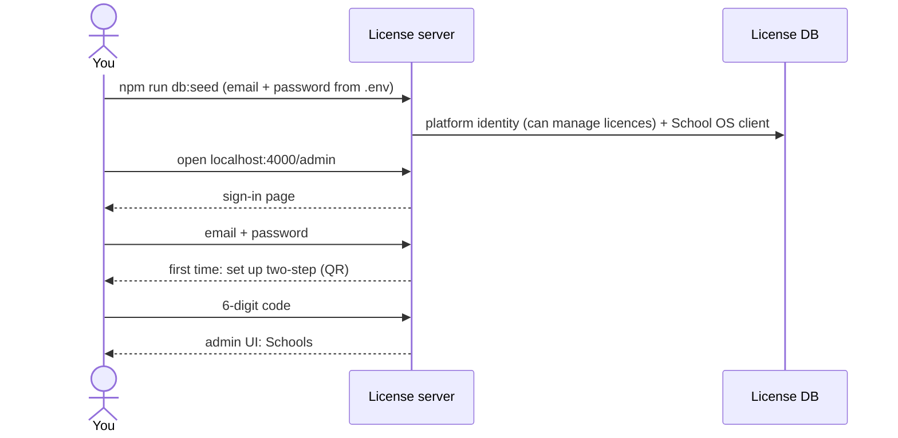

**F1.1 — Create your account (one-time seed)** · You · screen: [Seed the platform admin](system-map.html#screen/sys-seed)

- **What happens:** Put your email and a password you choose in `license-server/.env`, then run the seed once. It creates your platform identity with “can manage licences” and registers School OS as a client. Running it again changes nothing; it stops with a clear error if the password is missing (there is no default password).
- **Frontend:** —
- **Backend:** —
- **License server:** `prisma/seed.ts` via `npm run db:seed`; env `SEED_PLATFORM_ADMIN_EMAIL`, `SEED_PLATFORM_ADMIN_PASSWORD`
- **Data:** LS `users` (plane PLATFORM, `can_manage_licenses`), client `school-os-backend`
- **Phase:** LS-1
- **Today:** Not built: the license server only answers `GET /health` (LS-0).

**F1.2 — Open the admin UI and sign in** · You · screen: [Sign in](system-map.html#screen/ls-signin/normal)

- **What happens:** Start the license server (`npm run dev`, port 4000) and open `localhost:4000/admin`. With no session you get the sign-in page: enter your email and password.
- **Frontend:** —
- **Backend:** —
- **License server:** hosted sign-in page (`/interaction/:uid` login step); how `/admin` reuses it is set in the LS-7 spec
- **Data:** LS `users` (`failed_attempts`, `locked_until`, `last_sign_in_at`), `ls_audit_logs` (`signin.succeeded` / `signin.failed`)
- **Phase:** LS-1 (plain page) · LS-2 (final page) · LS-7 (`/admin`)
- **Today:** Not built.

**F1.3 — First time: set up two-step sign-in** · You · screen: [Two-step setup](system-map.html#screen/ls-2fa-setup)

- **What happens:** Platform staff always use two-step sign-in. Scan the QR code with an authenticator app, type the 6-digit code, and save the recovery codes, which are shown once.
- **Frontend:** —
- **Backend:** —
- **License server:** `/interaction/:uid/mfa`
- **Data:** LS `user_mfa_factors` (TOTP secret encrypted with AES-256-GCM, hashed recovery codes), `ls_audit_logs` (`mfa.enrolled`)
- **Phase:** LS-3
- **Today:** Not built.

**F1.4 — Land on Schools** · You · screen: [Schools](system-map.html#screen/ls-adm-schools)

- **What happens:** The admin UI opens for platform staff who can manage licences and have two-step on. Schools lists every school with its status, licence and how it joined.
- **Frontend:** —
- **Backend:** —
- **License server:** admin UI `/admin`
- **Data:** reads LS `tenants`, `tenant_licenses`
- **Phase:** LS-7
- **Today:** Not built.

### F2a — Signing in to School OS today (before Phase 4)

**Who:** Anyone with a School OS user · **Phases:** Built · replaced in 4.1 / 4.8 · [Walk it with mock screens](system-map.html#flows/F2a/1)

How sign-in works in the code today: a login form in School OS, JWT cookies issued by the backend.

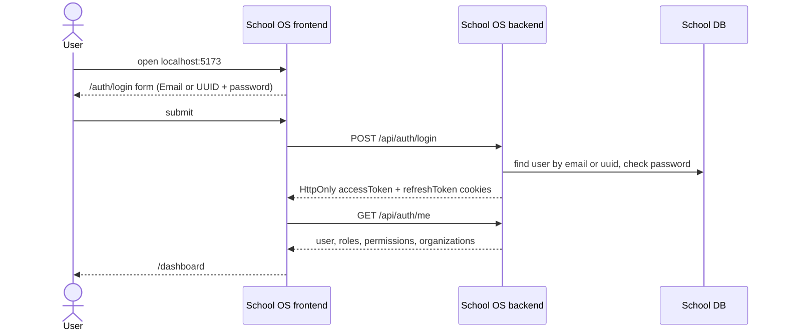

**F2a.1 — Open School OS** · User · screen: [Login (today)](system-map.html#screen/sos-login)

- **What happens:** `/` checks the readable `isLoggedIn` cookie and sends you to `/auth/login`. The form asks for “Email or UUID” and a password.
- **Frontend:** `frontend/src/routes/RootRedirect.tsx` → `frontend/src/routes/PublicRouter.tsx` → `frontend/src/pages/auth/login/page.tsx` + `frontend/src/components/login-form.tsx`
- **Backend:** —
- **License server:** —
- **Data:** —
- **Phase:** Built (replaced in 4.8)
- **Today:** This is how it works today.

**F2a.2 — Sign in** · User · screen: [Login (today)](system-map.html#screen/sos-login)

- **What happens:** `useLogin` posts the form. The backend finds the user by email or user ID (case-insensitive), checks the password and refuses inactive users (403). It sets HttpOnly `accessToken` and `refreshToken` cookies (lifetimes from `ACCESS_TOKEN_EXPIRE` / `REFRESH_TOKEN_EXPIRE`) plus the CSRF cookie. The SPA sets its own `isLoggedIn` cookie and opens `/dashboard`.
- **Frontend:** `frontend/src/hooks/auth/useAuth.ts` (`useLogin`) → `frontend/src/services/auth-services.ts` (`login`)
- **Backend:** `POST /api/auth/login` → `auth.controller.login` → `authService.loginUser` (`backend/src/services/auth.service.ts`)
- **License server:** —
- **Data:** reads `users`
- **Phase:** Built
- **Today:** A failed login shows two error toasts; the backend needs a password of at least 8 characters; token lifetime units are wrong (B5).

**F2a.3 — The dashboard loads with your permissions** · User · screen: [Dashboard](system-map.html#screen/sos-dashboard/today)

- **What happens:** `PrivateRouter` calls `/auth/me` once and stores the user, roles, permissions and organizations in Redux. A timer refreshes the tokens every 10 minutes; a 401 triggers one refresh and a retry.
- **Frontend:** `frontend/src/routes/PrivateRouter.tsx`, `frontend/src/store/auth/authSlice.ts`, `frontend/src/hooks/auth/useTokenRefresh.ts`, `frontend/src/services/axios-instance.ts`
- **Backend:** `GET /api/auth/me` → `auth.controller.me` → `authorizationService.getUserRoles` + `getEffectivePermissions`; `POST /api/auth/refresh` → `authService.refreshAccessToken`
- **License server:** —
- **Data:** reads `users`, `user_has_roles`, `role_has_permissions`, `user_has_permissions`
- **Phase:** Built
- **Today:** Possible login loop (B4); permissions go stale after a re-login in the same tab (N4); the dashboard shows mock data (N10).

### F2b — Signing in to School OS when finished (Phase 4)

**Who:** Everyone · **Phases:** 4.1 · 4.8 · 2.2 · LS-1 · LS-2 · LS-3 · LS-4 · [Walk it with mock screens](system-map.html#flows/F2b/1)

School OS has no login form: the backend sends you to the license server and keeps your tokens server-side (OIDC, backend-for-frontend).

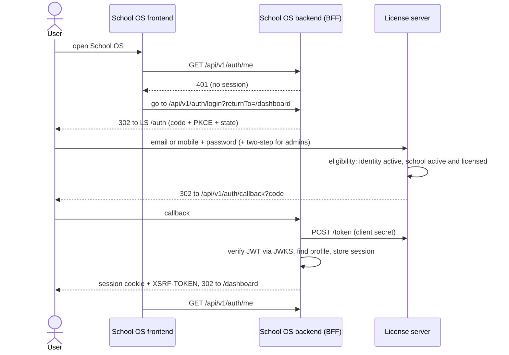

**F2b.1 — Open School OS** · User · screen: [Redirect to the license server](system-map.html#screen/sys-oidc-start)

- **What happens:** The SPA has no login form. `/auth/me` answers 401, so the browser goes to `/api/v1/auth/login?returnTo=/dashboard`, and the backend redirects to the license server with code + PKCE (S256) + state + nonce and `resource=school-os-api`.
- **Frontend:** route guard; `/auth/login` becomes a redirect (4.8)
- **Backend:** `GET /api/v1/auth/me` → 401; `GET /api/v1/auth/login` (4.1, `openid-client`)
- **License server:** `GET /auth` → `/interaction/:uid`
- **Data:** LS `oidc_payloads` (Interaction)
- **Phase:** 4.1 · 4.8 · LS-1
- **Today:** Today the School OS login form is used (F2a).

**F2b.2 — Enter email or mobile and password** · User · screen: [Sign in](system-map.html#screen/ls-signin/normal)

- **What happens:** Sign-in is by email or mobile + password; there are no login codes. After 5 wrong tries the account is locked for 15 minutes.
- **Frontend:** —
- **Backend:** —
- **License server:** `POST /interaction/:uid/login`
- **Data:** LS `users`, `ls_audit_logs`
- **Phase:** LS-1 · LS-2 · LS-3 (lockout)
- **Today:** Not built.

**F2b.3 — Admins: two-step code, then the eligibility check** · Platform staff · school admins · screen: [Two-step code](system-map.html#screen/ls-2fa-code/code)

- **What happens:** Platform staff and school admins type the 6-digit code from their authenticator app (or a recovery code). Then the license server checks eligibility: the identity must be active, and a school user must belong to at least one active school with a licence in Trial, Active or Grace. Otherwise the “access inactive” page is shown; school admins of an inactive school are let through so they can renew.
- **Frontend:** —
- **Backend:** —
- **License server:** `/interaction/:uid/mfa`; eligibility check in the login interaction
- **Data:** LS `user_mfa_factors` (`last_used_step`), `tenant_users`, `tenants`, `tenant_licenses`
- **Phase:** LS-3 · LS-4
- **Today:** Not built.

**F2b.4 — Back to School OS with a session** · Backend (automatic) · screen: [Callback and session](system-map.html#screen/sys-oidc-callback)

- **What happens:** The license server redirects to `/api/v1/auth/callback?code`. The backend exchanges the code with its client secret, verifies the RS256 access token against the cached JWKS (`iss`, `aud = school-os-api`, `exp`), finds the local profile by `identity_subject`, stores the tokens server-side and sets an HttpOnly session cookie plus `XSRF-TOKEN`.
- **Frontend:** —
- **Backend:** `GET /api/v1/auth/callback` (4.1)
- **License server:** `POST /token`, `GET /jwks`
- **Data:** backend `sessions` (2.2, encrypted refresh token), `users.identity_subject`; LS `oidc_payloads` (code consumed, grant, refresh token)
- **Phase:** 4.1 · 2.2 · LS-1
- **Today:** Not built.

**F2b.5 — The dashboard** · User · screen: [Dashboard](system-map.html#screen/sos-dashboard/today)

- **What happens:** `/api/v1/auth/me` returns the profile, scopes and permissions. From now on every request carries the session cookie, and every change sends `X-XSRF-TOKEN`.
- **Frontend:** session state comes only from `/auth/me`; the `isLoggedIn` cookie and the refresh timer are removed (4.8)
- **Backend:** `GET /api/v1/auth/me` (4.1)
- **License server:** —
- **Data:** reads backend `sessions`, `users`, role assignments
- **Phase:** 4.1 · 4.8 · 6.16 (real dashboard data)
- **Today:** The dashboard shows mock data (N10).

### F3 — Create a school in School OS and give it a licence

**Who:** Platform staff · you · **Phases:** 5.1 · 6.1 · LS-4 · LS-5 · LS-7 · 4.6 · [Walk it with mock screens](system-map.html#flows/F3/1)

Platform staff add the school in School OS; School OS registers it with the license server; you assign a plan in the license-server admin; School OS hears that the school is active.

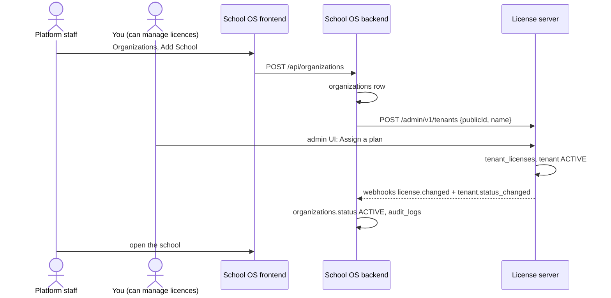

**F3.1 — Open Organizations** · Platform staff · screen: [Organizations](system-map.html#screen/sos-org-list)

- **What happens:** The Organizations page lists every school. “Add School” needs `organizations.create`.
- **Frontend:** `frontend/src/pages/organization/organization-list/organization-list-page.tsx` (`useOrganizations`)
- **Backend:** `GET /api/organizations` → `organization.controller.list` → `organizationService.list` (permission `organizations.view`)
- **License server:** —
- **Data:** reads `organizations`
- **Phase:** Built (rebuilt in 5.1 / 6.1)
- **Today:** Works for Super Admin. The list is not scoped to membership, and the seeded Admin role has no organization permissions (N7).

**F3.2 — Fill in the school and create it** · Platform staff · screen: [Add school](system-map.html#screen/sos-org-create)

- **What happens:** School name (required), school timing, email, mobile, website, address and social links. Saving creates the organization.
- **Frontend:** `frontend/src/pages/organization/organization-create/organization-create-page.tsx` (`useCreateOrganization`)
- **Backend:** `POST /api/organizations` → `organization.controller.create` → `organizationService.create` (permission `organizations.create`)
- **License server:** —
- **Data:** `organizations` (slug from the name; today `status` defaults to ACTIVE and `signup_source` to PLATFORM)
- **Phase:** Built (5.1 adds the status lifecycle, `onboarded_by` and audit)
- **Today:** Works; only the name is validated; there is no license-server call.

**F3.3 — School OS registers the school with the license server** · Backend (automatic) · screen: [Register a school (admin API)](system-map.html#screen/sys-provision-tenant)

- **What happens:** After creating the organization, the backend registers it as a tenant with the same public id, using its client-credentials token (scope `tenants:manage`).
- **Frontend:** —
- **Backend:** organization create (5.1) calling the license-server admin API
- **License server:** `POST /admin/v1/tenants {publicId, name}` → 201 (409 if the id already exists)
- **Data:** LS `tenants` (starting status [DECIDE], `signup_source` PLATFORM), `ls_audit_logs`
- **Phase:** 5.1 · LS-5
- **Today:** Not built.

**F3.4 — You assign a plan in the license-server admin** · You · screen: [School detail](system-map.html#screen/ls-adm-school/maple-leaf/assign) (with its dialog open)

- **What happens:** Schools → Maple Leaf School → Assign a plan. Pick the plan, the start date and any special limits for this school, and add a payment reference if you have one. Only one licence runs at a time.
- **Frontend:** —
- **Backend:** —
- **License server:** admin UI (LS-7); licence rules (LS-4)
- **Data:** LS `tenant_licenses` (limits copied from the plan), `tenant_entitlements`, `tenants.status` → ACTIVE, `webhook_events`, `ls_audit_logs` (`license.created`)
- **Phase:** LS-4 · LS-7
- **Today:** Not built.

**F3.5 — School OS hears about it** · License server → backend (automatic) · screen: [Status and licence webhook](system-map.html#screen/sys-webhook)

- **What happens:** Signed webhooks tell School OS the new status and limits. The backend checks the signature and the timestamp (5-minute window), ignores repeats by event id, then updates the organization and writes an audit row. A daily reconciliation catches anything missed.
- **Frontend:** —
- **Backend:** `POST /api/v1/auth/license-events` (4.6)
- **License server:** outbox → `tenant.status_changed`, `license.changed` (retries 1 min → 24 h, 10 attempts)
- **Data:** backend `organizations.status` (ACTIVE, `status_source` SUBSCRIPTION), cached limits, `audit_logs`; LS `webhook_deliveries`
- **Phase:** 4.6 · LS-5
- **Today:** Not built.

**F3.6 — The school is active in School OS** · Platform staff · screen: [School details](system-map.html#screen/sos-org-detail/target)

- **What happens:** The school page shows its status and a licence summary. From here platform staff invite the school admin (F4).
- **Frontend:** `frontend/src/pages/organization/organization-details/organization-details-page.tsx` (status and licence added in 6.1)
- **Backend:** `GET /api/organizations/:organizationId` → `organizationService.getById` + `getSummary`
- **License server:** —
- **Data:** reads `organizations` and the branch, staff and student counts
- **Phase:** 5.1 · 6.1
- **Today:** The page shows `isActive` only, and the summary counts always show 0 (B3).

### F4 — Invite the school admin; they accept and sign in

**Who:** Platform staff · the school admin · **Phases:** 5.7 · 6.7 · 2.2 · LS-5 · LS-2 · LS-3 · 4.1 · [Walk it with mock screens](system-map.html#flows/F4/1)

School OS keeps the invitation; the license server creates the identity and sends the set-password link; the school admin sets a password and two-step, then signs in.

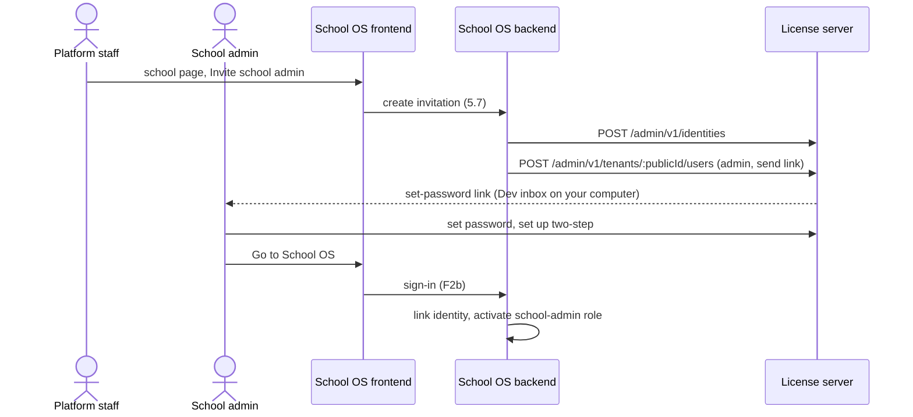

**F4.1 — Invite the school admin** · Platform staff · screen: [School details](system-map.html#screen/sos-org-detail/target/sos-invite-admin) (with its dialog open)

- **What happens:** On the school page choose Invite school admin: full name, and email or mobile. School OS keeps the invitation record.
- **Frontend:** invitation dialog (6.7, proposal)
- **Backend:** invitation endpoint (5.7; the path is set in the 5.7 spec)
- **License server:** —
- **Data:** backend `invitations` (2.2)
- **Phase:** 5.7 · 6.7 · 2.2
- **Today:** No invitations. Today a Super Admin creates the user in IAM (a default password is used when none is typed) and assigns a role, but the School Admin role has no permissions (N7) and organization-scoped roles never grant anything (B6).

**F4.2 — School OS provisions the identity** · Backend (automatic) · screen: [Provision a person (admin API)](system-map.html#screen/sys-provision-identity)

- **What happens:** The backend asks the license server to find or create the person's identity, then adds it to the school as tenant admin with “send set-password link”.
- **Frontend:** —
- **Backend:** invitation send (5.7)
- **License server:** `POST /admin/v1/identities {email | mobile, displayName, plane: school}` → `{sub}`; `POST /admin/v1/tenants/:publicId/users {sub, isTenantAdmin: true, sendSetPassword: true}`
- **Data:** LS `users` (INVITED), `tenant_users` (INVITED, `is_tenant_admin`), `password_reset_tokens` (SET_PASSWORD, 7 days), `outbound_messages` (`set_password`)
- **Phase:** 5.7 · LS-5
- **Today:** Not built.

**F4.3 — The invitation arrives** · School admin · screen: [Dev inbox](system-map.html#screen/ls-inbox/invite-admin)

- **What happens:** On your computer nothing is really sent: the email appears in the Dev inbox with a working link.
- **Frontend:** —
- **Backend:** —
- **License server:** `GET /dev/inbox` (only when `LS_ENV=local`)
- **Data:** LS `outbound_messages` (EMAIL, DEV_INBOX, STORED)
- **Phase:** LS-3
- **Today:** Not built.

**F4.4 — Set a password** · School admin · screen: [Set password](system-map.html#screen/ls-setpw/school-admin)

- **What happens:** The link works once, for 7 days. Setting the password also confirms the email address.
- **Frontend:** —
- **Backend:** —
- **License server:** `GET` / `POST /password/set/:token`
- **Data:** LS `users` (Argon2id `password_hash`, status ACTIVE, `email_verified_at`), `password_reset_tokens.used_at`
- **Phase:** LS-2 · LS-3
- **Today:** Not built.

**F4.5 — Set up two-step (required for school admins)** · School admin · screen: [Two-step setup](system-map.html#screen/ls-2fa-setup)

- **What happens:** Same page as for platform staff: scan the QR code, type the code, save the recovery codes.
- **Frontend:** —
- **Backend:** —
- **License server:** `/interaction/:uid/mfa`
- **Data:** LS `user_mfa_factors`
- **Phase:** LS-3
- **Today:** Not built.

**F4.6 — All set** · School admin · screen: [All set](system-map.html#screen/ls-done/school-admin)

- **What happens:** The last page offers “Go to School OS”.
- **Frontend:** —
- **Backend:** —
- **License server:** set-password flow, last step
- **Data:** —
- **Phase:** LS-2
- **Today:** Not built.

**F4.7 — First sign-in to School OS** · School admin · screen: [Dashboard](system-map.html#screen/sos-dashboard/today)

- **What happens:** Signing in (F2b) lands on the dashboard. On this first sign-in the backend links the identity to the profile and activates the school-admin role for this school.
- **Frontend:** —
- **Backend:** `GET /api/v1/auth/callback` (4.1); invitation acceptance (5.7)
- **License server:** —
- **Data:** backend `users.identity_subject`, `user_has_roles` (school-admin, organization scope), `invitations` (accepted), `audit_logs`; LS `tenant_users` ACTIVE
- **Phase:** 4.1 · 5.7
- **Today:** Not built.

### F5 — The school admin sets up the school

**Who:** School admin · **Phases:** 5.2 · 5.3 · 5.4 · 5.6 · 5.8–5.11 · 5.16 · 6.x · [Walk it with mock screens](system-map.html#flows/F5/1)

Branch, academic year, classes, subjects, designations, staff and students — with the trial limits of 1 branch, 100 students and 20 staff.

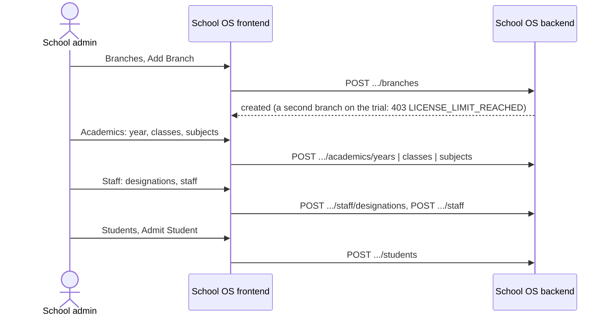

**F5.1 — Add the first branch** · School admin · screen: [Branches](system-map.html#screen/sos-branches/list/sos-add-branch) (with its dialog open)

- **What happens:** Branches → Add Branch: name (required), code, timing, email, mobile, address.
- **Frontend:** `frontend/src/pages/organization/branch/branch-list-page.tsx` (`useCreateBranch`)
- **Backend:** `POST /api/organizations/:organizationId/branches` → `branch.controller.create` → `branchService.create` (permission `branches.create`)
- **License server:** —
- **Data:** `branches`
- **Phase:** Built (5.2 adds the default branch and status)
- **Today:** Create works; edit returns 404 (B1); there is no delete in the UI.

**F5.2 — A second branch hits the trial limit** · School admin · screen: [Branches](system-map.html#screen/sos-branches/limit)

- **What happens:** The trial allows 1 branch. Creating another is refused with `403 LICENSE_LIMIT_REACHED`; nothing already there is deleted when a limit is lower.
- **Frontend:** limit message (6.18, proposal)
- **Backend:** limit check on create (5.16), using the limits received with `license.changed`
- **License server:** —
- **Data:** —
- **Phase:** 5.16 · 6.18
- **Today:** There are no limits today.

**F5.3 — Create the academic year** · School admin · screen: [Academics](system-map.html#screen/sos-academics/years/sos-add-year) (with its dialog open)

- **What happens:** Academics → Years → Add: name, start date, end date, current year.
- **Frontend:** `frontend/src/pages/organization/academics/academics-page.tsx` (`useCreateAcademicYear`)
- **Backend:** `POST /api/organizations/:organizationId/academics/years` → `academic.controller.createYear` → `academicService.createYear` (permission `academics.create`)
- **License server:** —
- **Data:** `academic_years`
- **Phase:** Built (5.8)
- **Today:** Leaving the dates empty fails because they are required columns (N5); edit returns 404 (B1).

**F5.4 — Add classes** · School admin · screen: [Academics](system-map.html#screen/sos-academics/classes/sos-add-class) (with its dialog open)

- **What happens:** Classes → Add: name and display order. Sections exist in the API but have no screen yet.
- **Frontend:** `frontend/src/pages/organization/academics/academics-page.tsx` (`useCreateClass`)
- **Backend:** `POST .../academics/classes` → `academicService.createClass`; sections: `POST .../academics/classes/:classId/sections` (no screen)
- **License server:** —
- **Data:** `classes`, `sections`
- **Phase:** Built (5.9 grade levels · 5.10 classes and sections)
- **Today:** Edit returns 404 (B1); no sections screen.

**F5.5 — Add subjects** · School admin · screen: [Academics](system-map.html#screen/sos-academics/subjects/sos-add-subject) (with its dialog open)

- **What happens:** Subjects → Add: name, code and type (theory, practical or both).
- **Frontend:** `frontend/src/pages/organization/academics/academics-page.tsx` (`useCreateSubject`)
- **Backend:** `POST .../academics/subjects` → `academicService.createSubject`
- **License server:** —
- **Data:** `subjects`
- **Phase:** Built (5.11)
- **Today:** Edit returns 404 (B1).

**F5.6 — Add designations** · School admin · screen: [Staff](system-map.html#screen/sos-staff/sos-designations) (with its dialog open)

- **What happens:** Staff → Manage Designations → add a designation (name, description).
- **Frontend:** `frontend/src/pages/organization/staff/staff-list-page.tsx` (`useCreateDesignation`)
- **Backend:** `POST .../staff/designations` → `staffService.createDesignation`
- **License server:** —
- **Data:** `designations`
- **Phase:** Built (5.3 adds departments)
- **Today:** The Manage Designations button is not permission-gated; editing a designation returns 404 (B1).

**F5.7 — Add staff** · School admin · screen: [Staff](system-map.html#screen/sos-staff/sos-add-staff) (with its dialog open)

- **What happens:** Today you pick an existing user plus designation, employee code and joining date. Once invitations exist (5.7), staff are invited by email or mobile instead (F6). The trial allows 20 staff.
- **Frontend:** `frontend/src/pages/organization/staff/staff-list-page.tsx` (`useCreateStaff`)
- **Backend:** `POST .../staff` → `staffService.create` (permission `staff.create`)
- **License server:** —
- **Data:** `staff`
- **Phase:** Built (5.4 · 5.7 · 5.16 limit)
- **Today:** The user picker needs `users.view` and hides users who hold a system role (N1).

**F5.8 — Admit students** · School admin · screen: [Students](system-map.html#screen/sos-students/list/sos-admit) (with its dialog open)

- **What happens:** Students → Admit Student: admission number and name (required), date of birth, gender, email, mobile, admission date, address. The trial allows 100 students.
- **Frontend:** `frontend/src/pages/organization/students/student-list-page.tsx` (`useCreateStudent`)
- **Backend:** `POST .../students` → `studentService.create` (permission `students.create`)
- **License server:** —
- **Data:** `students`
- **Phase:** Built (5.6 · 5.13 enrollments · 5.16 limit)
- **Today:** Edit returns 404 (B1) and sends an empty gender (N8); there is no enrollment screen.

### F6 — A teacher is invited and signs in

**Who:** School admin · teacher · **Phases:** 5.7 · 6.7 · LS-5 · LS-2 · 4.3 · 6.17 · [Walk it with mock screens](system-map.html#flows/F6/1)

The same invitation path as F4, without two-step; the teacher then sees only what the Teacher role allows.

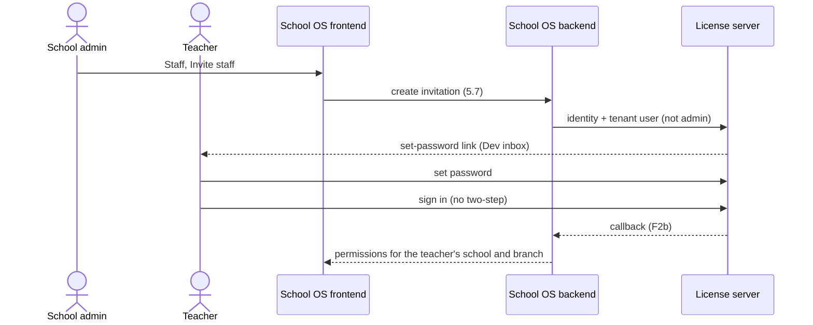

**F6.1 — Invite a teacher** · School admin · screen: [Staff](system-map.html#screen/sos-staff/sos-invite-staff) (with its dialog open)

- **What happens:** Staff → Invite staff: name, email or mobile, designation, role and branch.
- **Frontend:** invite dialog (6.7, proposal)
- **Backend:** invitation endpoint (5.7)
- **License server:** —
- **Data:** backend `invitations`
- **Phase:** 5.7 · 6.7
- **Today:** Not built; see F5 step 7.

**F6.2 — School OS provisions the identity** · Backend (automatic) · screen: [Provision a person (admin API)](system-map.html#screen/sys-provision-identity)

- **What happens:** The same calls as F4 step 2, with `isTenantAdmin: false`.
- **Frontend:** —
- **Backend:** invitation send (5.7)
- **License server:** `POST /admin/v1/identities`, `POST /admin/v1/tenants/:publicId/users`
- **Data:** LS `users`, `tenant_users`, `password_reset_tokens`, `outbound_messages`
- **Phase:** 5.7 · LS-5
- **Today:** Not built.

**F6.3 — The invitation arrives** · Teacher · screen: [Dev inbox](system-map.html#screen/ls-inbox/invite-staff)

- **What happens:** The invitation email in the Dev inbox.
- **Frontend:** —
- **Backend:** —
- **License server:** `GET /dev/inbox`
- **Data:** LS `outbound_messages`
- **Phase:** LS-3
- **Today:** Not built.

**F6.4 — Set a password** · Teacher · screen: [Set password](system-map.html#screen/ls-setpw/staff)

- **What happens:** Teachers don't need two-step sign-in, so this goes straight to All set.
- **Frontend:** —
- **Backend:** —
- **License server:** `GET` / `POST /password/set/:token`
- **Data:** LS `users` (`password_hash`, ACTIVE)
- **Phase:** LS-2 · LS-3
- **Today:** Not built.

**F6.5 — All set** · Teacher · screen: [All set](system-map.html#screen/ls-done/staff)

- **What happens:** “Go to School OS”.
- **Frontend:** —
- **Backend:** —
- **License server:** —
- **Data:** —
- **Phase:** LS-2
- **Today:** Not built.

**F6.6 — Everyday sign-in** · Teacher · screen: [Sign in](system-map.html#screen/ls-signin/normal)

- **What happens:** Email or mobile + password, with no two-step code, then back to School OS (F2b).
- **Frontend:** —
- **Backend:** `GET /api/v1/auth/callback`
- **License server:** `POST /interaction/:uid/login`
- **Data:** LS `ls_audit_logs`; backend `sessions`
- **Phase:** LS-2 · 4.1
- **Today:** Today: the School OS login form (F2a).

**F6.7 — Only permitted menus and data** · Teacher · screen: [Dashboard](system-map.html#screen/sos-dashboard/teacher)

- **What happens:** The sidebar is built from the teacher's permissions (6.17), and every request is checked in the backend for the teacher's school and branch (4.3).
- **Frontend:** sidebar from route config and permissions (6.17)
- **Backend:** `authorize()` with `ScopeContext` (4.3)
- **License server:** —
- **Data:** reads `user_has_roles` (branch scope), `role_has_permissions`
- **Phase:** 4.3 · 6.17
- **Today:** The sidebar only hides Organizations. The seeded Teacher role has no permissions (N7); what a teacher may do comes from the design document's role mappings (§11), which are not in the repository yet.

### F7 — Roles and permissions (IAM)

**Who:** Super Admin / Admin today · **Phases:** Built · 4.3 · 4.4 · [Walk it with mock screens](system-map.html#flows/F7/1)

Create a role, give it permissions, give a user a role and direct exceptions — and when the change takes effect.

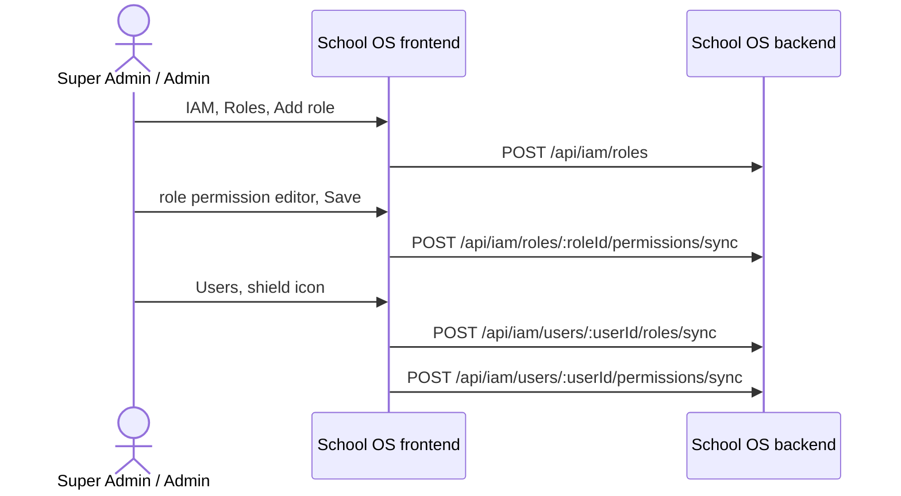

**F7.1 — Create a role** · Super Admin / Admin · screen: [IAM](system-map.html#screen/sos-iam/roles/sos-add-role) (with its dialog open)

- **What happens:** IAM → Roles → Add role: name, type (normal or secondary) and description.
- **Frontend:** `frontend/src/pages/system/iam/components/RolesTab.tsx` (`useCreateRole`)
- **Backend:** `POST /api/iam/roles` → `role.controller.createRole` → `roleService.createRole` (permission `roles.create`)
- **License server:** —
- **Data:** `roles`
- **Phase:** Built (4.4 adds the delegation ceiling)
- **Today:** Choosing “secondary” makes it a system role, and users who hold it disappear from the Users tab (N1). Anyone with `roles.create` can create a primary role (fixed in 4.4).

**F7.2 — Give the role permissions** · Super Admin / Admin · screen: [Role permissions](system-map.html#screen/sos-iam-role-perms)

- **What happens:** Tick permissions, grouped by resource. Create, edit and delete need View first. Save replaces the role's permission list.
- **Frontend:** `frontend/src/pages/system/iam/role-permissions/page.tsx`, `frontend/src/pages/system/iam/components/PermissionEditor.tsx` (`useSyncRolePermissions`)
- **Backend:** `POST /api/iam/roles/:roleId/permissions/sync {permissionIds}` → `rolePermissionService.syncRolePermissions` (checked as `roles.edit`)
- **License server:** —
- **Data:** `role_has_permissions`
- **Phase:** Built (4.4 adds a transaction and audit)
- **Today:** No transaction; the seeded `role-permission.*` permissions guard nothing.

**F7.3 — Find the user** · Super Admin / Admin · screen: [IAM](system-map.html#screen/sos-iam/users)

- **What happens:** IAM → Users; the shield icon opens that user's roles and permissions.
- **Frontend:** `frontend/src/pages/system/iam/components/UsersTab.tsx` (`useUsers`)
- **Backend:** `GET /api/users` → `userService.getUsers` (permission `users.view`)
- **License server:** —
- **Data:** reads `users`, `user_has_roles`
- **Phase:** Built
- **Today:** Users who hold a system role are hidden (N1).

**F7.4 — Give the user a role and exceptions** · Super Admin / Admin · screen: [User role and permissions](system-map.html#screen/sos-iam-user-perms)

- **What happens:** Pick one role and save it; optionally allow extra permissions directly.
- **Frontend:** `frontend/src/pages/system/iam/user-permissions/page.tsx` (`useSyncUserRoles`, `useSyncUserPermissions`)
- **Backend:** `POST /api/iam/users/:userId/roles/sync {roleIds}` → `userRoleService.syncUserRoles`; `POST /api/iam/users/:userId/permissions/sync` → `userPermissionService.syncUserPermissions`
- **License server:** —
- **Data:** `user_has_roles`, `user_has_permissions` (target: scope, validity and grant history, the 2.1 columns)
- **Phase:** Built (rebuilt in 4.4)
- **Today:** Only one role can be kept. Saving deletes every role row of the user, including a hidden Super Admin row and organization-scoped roles (B10, N2). Saving direct permissions turns existing denies into allows (B11, N3).

**F7.5 — The change takes effect** · Backend (automatic) · screen: [A permission change takes effect](system-map.html#screen/sys-access-version)

- **What happens:** Target: every role, permission or status change raises the user's `access_version`, so the very next request recomputes the permissions.
- **Frontend:** —
- **Backend:** `authorize()` permission cache keyed by `access_version` (ADR-003 §6)
- **License server:** —
- **Data:** backend `users.access_version`, `audit_logs`
- **Phase:** 4.3 · 4.4
- **Today:** The UI keeps the permissions it loaded at sign-in until a full page reload (N4).

### F8 — A school signs itself up for the free trial

**Who:** Visitor → school admin · **Phases:** 6.18 · 5.16 · LS-4 · LS-5 · 4.6 (ADR-007) · [Walk it with mock screens](system-map.html#flows/F8/1)

The public School OS sign-up page; one idempotent license-server call; the trial starts when the admin confirms and sets a password.

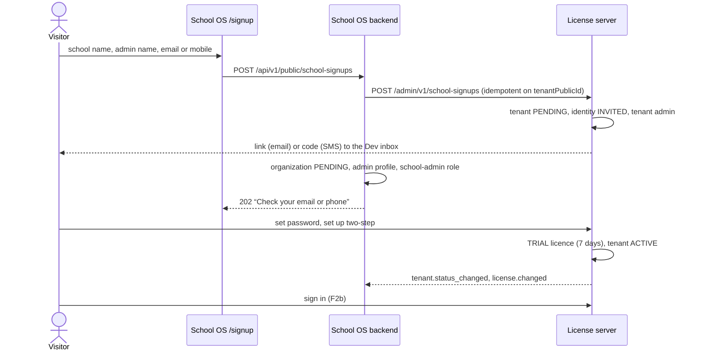

**F8.1 — Start a free trial** · Visitor · screen: [Start a free trial (/signup)](system-map.html#screen/sos-signup/form)

- **What happens:** School name, your full name, and email or mobile (at least one). There is no password field: the password is set on the license server's page.
- **Frontend:** `/signup` page (6.18, proposal)
- **Backend:** —
- **License server:** —
- **Data:** —
- **Phase:** 6.18
- **Today:** Not built; `/auth/register` shows the login page.

**F8.2 — School OS creates the school and the admin** · Backend + license server (automatic) · screen: [Self-service sign-up calls](system-map.html#screen/sys-signup)

- **What happens:** The backend generates the school's public id and calls the license server once: tenant PENDING, identity INVITED, tenant admin, and the link or SMS code sent. Then, in one transaction, it creates the organization (PENDING), the admin's profile and the school-admin role assignment. The endpoint allows 5 sign-ups per hour per IP.
- **Frontend:** —
- **Backend:** `POST /api/v1/public/school-signups` (5.16; Joi-validated, rate-limited)
- **License server:** `POST /admin/v1/school-signups` (scope `signups:create`) → 202 `{tenantPublicId, adminSub, status: PENDING}` or `{outcome: TRIAL_ALREADY_USED}`
- **Data:** LS `tenants` (PENDING, SELF_SERVICE), `users` (INVITED), `tenant_users`, `password_reset_tokens`, `outbound_messages`; backend `organizations` (PENDING, `status_source` SUBSCRIPTION, `signup_source` SELF_SERVICE, `onboarded_by` empty), `users` profile, `user_has_roles`
- **Phase:** 5.16 · LS-5
- **Today:** Not built.

**F8.3 — Always the same answer** · Visitor · screen: [Start a free trial (/signup)](system-map.html#screen/sos-signup/sent)

- **What happens:** The page always says “Check your email or phone to continue”, whatever happened, so nobody can learn which contacts exist. A contact that already ran a trial gets “contact us” by email or SMS instead of a new trial.
- **Frontend:** `/signup` (6.18)
- **Backend:** 202 from `POST /api/v1/public/school-signups`
- **License server:** —
- **Data:** —
- **Phase:** 6.18 · ADR-007 D2, D3
- **Today:** Not built.

**F8.4 — Confirm the email** · School admin · screen: [Dev inbox](system-map.html#screen/ls-inbox/signup)

- **What happens:** The confirmation email in the Dev inbox.
- **Frontend:** —
- **Backend:** —
- **License server:** `GET /dev/inbox`
- **Data:** LS `outbound_messages` (`set_password`)
- **Phase:** LS-3
- **Today:** Not built.

**F8.5 — Set a password** · School admin · screen: [Set password](system-map.html#screen/ls-setpw/signup)

- **What happens:** This confirms the email and starts the trial.
- **Frontend:** —
- **Backend:** —
- **License server:** `GET` / `POST /password/set/:token`
- **Data:** LS `users` (ACTIVE, `email_verified_at`)
- **Phase:** LS-2 · LS-3
- **Today:** Not built.

**F8.6 — Set up two-step** · School admin · screen: [Two-step setup](system-map.html#screen/ls-2fa-setup)

- **What happens:** Required for school admins.
- **Frontend:** —
- **Backend:** —
- **License server:** `/interaction/:uid/mfa`
- **Data:** LS `user_mfa_factors`
- **Phase:** LS-3
- **Today:** Not built.

**F8.7 — The trial has started** · School admin · screen: [All set](system-map.html#screen/ls-done/signup)

- **What happens:** Identity ACTIVE, a TRIAL licence from today for 7 days (1 branch, 100 students, 20 staff, all features), tenant ACTIVE.
- **Frontend:** —
- **Backend:** —
- **License server:** set-password flow; trial plan (LS-4)
- **Data:** LS `tenant_licenses` (TRIAL), `tenant_entitlements`, `tenants.status`
- **Phase:** LS-4
- **Today:** Not built.

**F8.8 — School OS activates the school** · License server → backend (automatic) · screen: [Status and licence webhook](system-map.html#screen/sys-webhook)

- **What happens:** `tenant.status_changed` makes the organization ACTIVE; `license.changed` delivers the limits the backend enforces.
- **Frontend:** —
- **Backend:** `POST /api/v1/auth/license-events` (4.6)
- **License server:** webhooks from the outbox
- **Data:** backend `organizations.status`, cached limits, `audit_logs`
- **Phase:** 4.6 · LS-5
- **Today:** Not built.

**F8.9 — First sign-in, with the trial banner** · School admin · screen: [Dashboard](system-map.html#screen/sos-dashboard/trial)

- **What happens:** After signing in (F2b) the school admin sets up the school (F5); a banner shows how many trial days are left.
- **Frontend:** trial banner (6.18, proposal)
- **Backend:** `GET /api/v1/auth/me`
- **License server:** —
- **Data:** —
- **Phase:** 6.18
- **Today:** Not built.

**F8.10 — If nobody confirms** · Daily job (automatic) · screen: [School detail](system-map.html#screen/ls-adm-school/hillcrest)

- **What happens:** Unconfirmed sign-ups expire after 7 days (the link lifetime): the tenant and the organization become CLOSED.
- **Frontend:** —
- **Backend:** status webhook (4.6)
- **License server:** daily job (LS-4)
- **Data:** LS `tenants` (CLOSED); backend `organizations` (CLOSED)
- **Phase:** LS-4 · 4.6 · ADR-007 D4
- **Today:** Not built.

### F9 — Forgot and reset a password

**Who:** Everyone · **Phases:** LS-3 · [Walk it with mock screens](system-map.html#flows/F9/1)

Handled entirely by the license server; the answer never reveals whether an account exists.

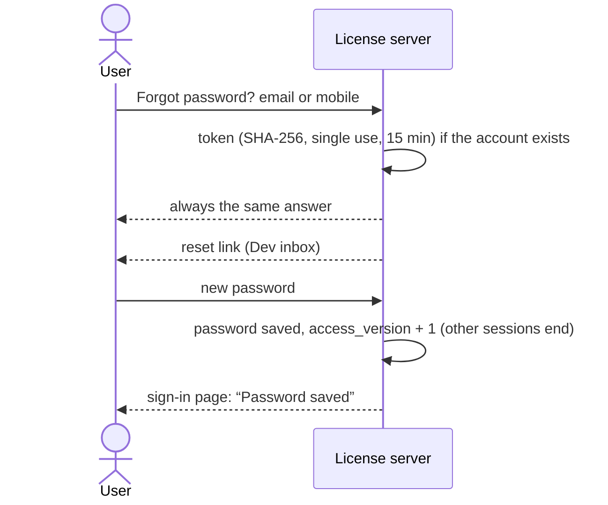

**F9.1 — Forgot password?** · User · screen: [Sign in](system-map.html#screen/ls-signin/normal)

- **What happens:** On the sign-in page choose “Forgot password?”.
- **Frontend:** —
- **Backend:** —
- **License server:** hosted sign-in page
- **Data:** —
- **Phase:** LS-2
- **Today:** School OS has `POST /api/auth/forgot-password`, `POST /api/auth/reset-password/:token` and `GET /api/auth/verify-reset-token/:token`, but no screen (“Forgot your password?” goes nowhere) and the email is never sent (B13). They are removed in 4.2.

**F9.2 — Ask for a reset link** · User · screen: [Forgot password](system-map.html#screen/ls-forgot/form)

- **What happens:** Enter the email or mobile number.
- **Frontend:** —
- **Backend:** —
- **License server:** `POST /password/forgot` (always 200)
- **Data:** LS `password_reset_tokens` (RESET, SHA-256 hash, single use, 15 min), `outbound_messages` (`reset_password`)
- **Phase:** LS-3
- **Today:** Not built.

**F9.3 — The same answer every time** · User · screen: [Forgot password](system-map.html#screen/ls-forgot/sent)

- **What happens:** “If this account exists, a reset link is on its way.”
- **Frontend:** —
- **Backend:** —
- **License server:** —
- **Data:** —
- **Phase:** LS-3
- **Today:** Not built.

**F9.4 — Open the link** · User · screen: [Dev inbox](system-map.html#screen/ls-inbox/reset)

- **What happens:** The reset email in the Dev inbox.
- **Frontend:** —
- **Backend:** —
- **License server:** `GET /dev/inbox`
- **Data:** LS `outbound_messages`
- **Phase:** LS-3
- **Today:** Not built.

**F9.5 — Choose a new password** · User · screen: [Reset password](system-map.html#screen/ls-reset)

- **What happens:** Saving signs the person out on every other device.
- **Frontend:** —
- **Backend:** —
- **License server:** `GET` / `POST /password/reset/:token`
- **Data:** LS `users` (`password_hash`, `password_changed_at`, `access_version` + 1), `password_reset_tokens.used_at`, `ls_audit_logs` (`password.reset`)
- **Phase:** LS-3
- **Today:** Not built.

**F9.6 — Sign in with the new password** · User · screen: [Sign in](system-map.html#screen/ls-signin/saved)

- **What happens:** The sign-in page confirms the password was saved.
- **Frontend:** —
- **Backend:** —
- **License server:** hosted sign-in page
- **Data:** —
- **Phase:** LS-2 · LS-3
- **Today:** Not built.

### F10 — A licence runs out

**Who:** License server · school admins · you · **Phases:** LS-4 · LS-5 · LS-7 · 4.6 · 6.18 · [Walk it with mock screens](system-map.html#flows/F10/1)

Reminder, grace period, expiry, inactive school, the renewal page, and a new licence.

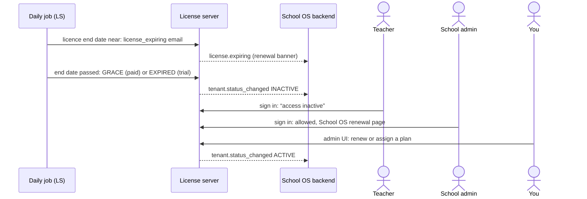

**F10.1 — Reminder before the end** · License server (automatic) · screen: [Dev inbox](system-map.html#screen/ls-inbox/expiring)

- **What happens:** School admins get a reminder, and School OS gets `license.expiring` so it can show a renewal banner. How many days before the end is [DECIDE].
- **Frontend:** renewal banner (6.18)
- **Backend:** `POST /api/v1/auth/license-events` (4.6)
- **License server:** expiry job (LS-4) → `outbound_messages` (`license_expiring`); webhook `license.expiring {tenantPublicId, endsOn, daysLeft}`
- **Data:** LS `outbound_messages`, `webhook_events`
- **Phase:** LS-4 · LS-5 · 6.18
- **Today:** Not built.

**F10.2 — The end date passes** · Daily job (automatic) · screen: [Daily licence check](system-map.html#screen/sys-daily-job)

- **What happens:** A daily job checks every licence. Paid plans move into their grace period and the school stays Active; the trial has no grace days, so it expires at once.
- **Frontend:** —
- **Backend:** —
- **License server:** daily expiry job (LS-4)
- **Data:** LS `tenant_licenses.status` (GRACE / EXPIRED), `tenants.status`, `webhook_events`
- **Phase:** LS-4
- **Today:** Not built.

**F10.3 — In the grace period** · You · screen: [School detail](system-map.html#screen/ls-adm-school/sunrise)

- **What happens:** A paid school in grace: still active, with the grace end date shown.
- **Frontend:** —
- **Backend:** —
- **License server:** admin UI (LS-7)
- **Data:** reads LS `tenant_licenses`
- **Phase:** LS-4 · LS-7
- **Today:** Not built.

**F10.4 — Expired: the school is inactive** · You · screen: [School detail](system-map.html#screen/ls-adm-school/northfield)

- **What happens:** Licence EXPIRED → tenant INACTIVE → `tenant.status_changed` → the organization becomes INACTIVE in School OS.
- **Frontend:** —
- **Backend:** `POST /api/v1/auth/license-events` (4.6)
- **License server:** webhook `tenant.status_changed`
- **Data:** LS `tenants`; backend `organizations.status`, `audit_logs`
- **Phase:** LS-4 · 4.6
- **Today:** Not built.

**F10.5 — A teacher tries to sign in** · Teacher · screen: [School access inactive](system-map.html#screen/ls-inactive)

- **What happens:** Refused with “access inactive” (`access_denied` / `school_access_inactive`), without saying why.
- **Frontend:** —
- **Backend:** —
- **License server:** eligibility check in the login interaction (LS-4)
- **Data:** LS `ls_audit_logs` (DENIED)
- **Phase:** LS-4 · LS-2
- **Today:** Not built.

**F10.6 — A school admin signs in to renew** · School admin · screen: [Renewal page](system-map.html#screen/sos-renewal)

- **What happens:** School admins of an inactive school are let in and see the renewal page. Upgrading is done by the School OS team in the admin UI (there is no payment integration yet).
- **Frontend:** renewal page (6.18, proposal)
- **Backend:** `GET /api/v1/auth/me` (organization status INACTIVE)
- **License server:** eligibility lets tenant admins in
- **Data:** —
- **Phase:** 6.18 · LS-4
- **Today:** Not built.

**F10.7 — You renew or assign a plan** · You · screen: [Licences](system-map.html#screen/ls-adm-licences/assign) (with its dialog open)

- **What happens:** A new licence makes the school active again, and School OS is told by webhook.
- **Frontend:** —
- **Backend:** `POST /api/v1/auth/license-events`
- **License server:** admin UI (LS-7)
- **Data:** LS `tenant_licenses`, `tenants.status` ACTIVE, `webhook_events`
- **Phase:** LS-7 · 4.6
- **Today:** Not built.

### F11 — Suspend, unsuspend or close a school

**Who:** You (can manage licences) · **Phases:** LS-7 · LS-5 · 4.6 · [Walk it with mock screens](system-map.html#flows/F11/1)

Manual status changes, each with a reason, audited and sent to School OS.

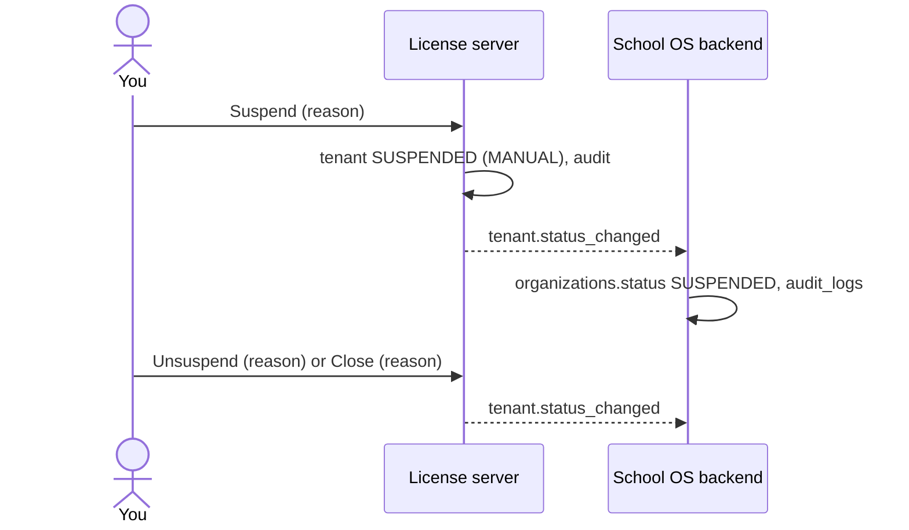

**F11.1 — Suspend a school** · You · screen: [School detail](system-map.html#screen/ls-adm-school/green-valley/suspend) (with its dialog open)

- **What happens:** A reason is required. Nobody from the school can sign in, admins included, and a licence change doesn't lift a suspension.
- **Frontend:** —
- **Backend:** —
- **License server:** admin UI (LS-7); School OS can do the same with `PATCH /admin/v1/tenants/:publicId/status {status, reason}` (scope `tenants:manage`)
- **Data:** LS `tenants` (SUSPENDED, `status_source` MANUAL, `status_reason`, `status_changed_at`), `ls_audit_logs`, `webhook_events`
- **Phase:** LS-7 · LS-5
- **Today:** Not built.

**F11.2 — School OS is told** · License server → backend (automatic) · screen: [Status and licence webhook](system-map.html#screen/sys-webhook)

- **What happens:** `tenant.status_changed` → organization SUSPENDED, with an audit row.
- **Frontend:** —
- **Backend:** `POST /api/v1/auth/license-events` (4.6)
- **License server:** webhook outbox
- **Data:** backend `organizations` (`status`, `status_source`, `status_reason`), `audit_logs`
- **Phase:** 4.6 · LS-5
- **Today:** Not built.

**F11.3 — Unsuspend** · You · screen: [School detail](system-map.html#screen/ls-adm-school/cedar-grove/unsuspend) (with its dialog open)

- **What happens:** The school goes back to what its licence allows.
- **Frontend:** —
- **Backend:** status webhook (4.6)
- **License server:** admin UI (LS-7)
- **Data:** LS `tenants`, `ls_audit_logs`
- **Phase:** LS-7
- **Today:** Not built.

**F11.4 — Close a school** · You · screen: [School detail](system-map.html#screen/ls-adm-school/cedar-grove/close) (with its dialog open)

- **What happens:** Everyone loses access. Whether a closed school can ever be reopened is [DECIDE].
- **Frontend:** —
- **Backend:** status webhook (4.6)
- **License server:** admin UI (LS-7)
- **Data:** LS `tenants` (CLOSED), `ls_audit_logs`
- **Phase:** LS-7
- **Today:** Not built.

**F11.5 — What a closed school looks like** · You · screen: [School detail](system-map.html#screen/ls-adm-school/hillcrest)

- **What happens:** No actions are offered for a closed school.
- **Frontend:** —
- **Backend:** —
- **License server:** admin UI (LS-7)
- **Data:** —
- **Phase:** LS-7
- **Today:** Not built.

### F12 — Manage platform staff

**Who:** You (can manage licences) · **Phases:** LS-7 · LS-3 · [Walk it with mock screens](system-map.html#flows/F12/1)

Invite a colleague, choose who can manage licences, reset two-step, disable an account. The rules shown are proposals to confirm.

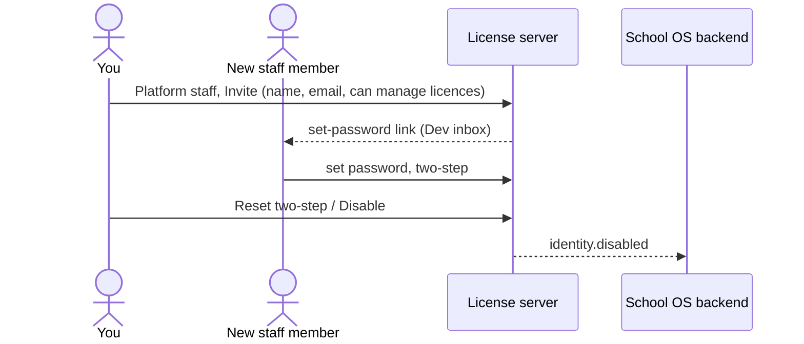

**F12.1 — Invite a staff member** · You · screen: [Platform staff](system-map.html#screen/ls-adm-staff/invite-staff) (with its dialog open)

- **What happens:** Full name, work email, and whether they can manage licences.
- **Frontend:** —
- **Backend:** —
- **License server:** admin UI (LS-7)
- **Data:** LS `users` (plane PLATFORM, INVITED, `can_manage_licenses`), `password_reset_tokens`, `outbound_messages`, `ls_audit_logs`
- **Phase:** LS-7
- **Today:** Not built. How a platform identity gets its School OS platform role (Super Admin or Admin) is [DECIDE] (4.5).

**F12.2 — The invitation arrives** · New staff member · screen: [Dev inbox](system-map.html#screen/ls-inbox/invite-platform)

- **What happens:** The invitation email in the Dev inbox.
- **Frontend:** —
- **Backend:** —
- **License server:** `GET /dev/inbox`
- **Data:** LS `outbound_messages`
- **Phase:** LS-3
- **Today:** Not built.

**F12.3 — Set a password** · New staff member · screen: [Set password](system-map.html#screen/ls-setpw/platform)

- **What happens:** Platform staff continue to two-step setup.
- **Frontend:** —
- **Backend:** —
- **License server:** `GET` / `POST /password/set/:token`
- **Data:** LS `users`
- **Phase:** LS-2 · LS-3
- **Today:** Not built.

**F12.4 — Set up two-step (always required)** · New staff member · screen: [Two-step setup](system-map.html#screen/ls-2fa-setup)

- **What happens:** Required for everyone on the platform plane.
- **Frontend:** —
- **Backend:** —
- **License server:** `/interaction/:uid/mfa`
- **Data:** LS `user_mfa_factors`
- **Phase:** LS-3
- **Today:** Not built.

**F12.5 — All set** · New staff member · screen: [All set](system-map.html#screen/ls-done/platform)

- **What happens:** Staff who can manage licences also get “Open the admin UI”.
- **Frontend:** —
- **Backend:** —
- **License server:** —
- **Data:** —
- **Phase:** LS-2 · LS-7
- **Today:** Not built.

**F12.6 — Reset two-step for someone who lost their phone** · You · screen: [Platform staff](system-map.html#screen/ls-adm-staff/reset2fa) (with its dialog open)

- **What happens:** Their old codes stop working and they are signed out; next time they set up two-step again.
- **Frontend:** —
- **Backend:** —
- **License server:** admin UI (LS-7)
- **Data:** LS `user_mfa_factors` (removed), `users.access_version` + 1, `ls_audit_logs`
- **Phase:** LS-7
- **Today:** Not built.

**F12.7 — Disable an account** · You · screen: [Platform staff](system-map.html#screen/ls-adm-staff/disable) (with its dialog open)

- **What happens:** They are signed out and can no longer sign in to School OS or to the admin UI. Proposed rule to confirm: nobody can disable themselves or the last person who can manage licences.
- **Frontend:** —
- **Backend:** webhook `identity.disabled` → local profile DISABLED, `access_version` + 1 (4.6)
- **License server:** admin UI (LS-7); admin API equivalent `POST /admin/v1/identities/:sub/disable`
- **Data:** LS `users.status` DISABLED, `access_version` + 1, `webhook_events`
- **Phase:** LS-7 · LS-5 · 4.6
- **Today:** Not built.

### F13 — Exams and marks

**Who:** School admin · teachers · **Phases:** 5.14 · 5.15 · 6.14 · 6.15 · [Walk it with mock screens](system-map.html#flows/F13/1)

Creating an exam works today; exam subjects, marks entry, publication and corrections are future screens.

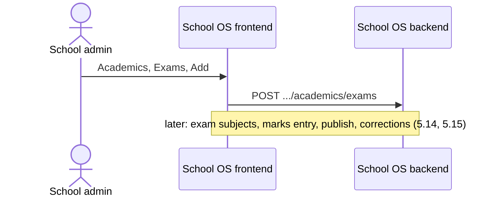

**F13.1 — Create an exam** · School admin · screen: [Academics](system-map.html#screen/sos-academics/exams/sos-add-exam) (with its dialog open)

- **What happens:** Name and academic year (required), exam type, start and end dates.
- **Frontend:** `frontend/src/pages/organization/academics/academics-page.tsx` (`useCreateExam`)
- **Backend:** `POST .../academics/exams` → `academicService.createExam`
- **License server:** —
- **Data:** `exams`
- **Phase:** Built (5.14)
- **Today:** There is no edit screen for exams.

**F13.2 — Enter, publish and correct marks** · Teachers · school admin · screen: [Marks entry, publication and corrections](system-map.html#screen/future-marks)

- **What happens:** Future screens: exam subjects, marks entry, publication and corrections.
- **Frontend:** 6.14 · 6.15
- **Backend:** today `GET` / `POST .../academics/marks` exist without a screen
- **License server:** —
- **Data:** `exam_subjects`, `marks`, `mark_corrections` (2.5)
- **Phase:** 5.14 · 5.15 · 6.14 · 6.15
- **Today:** No marks screen.

### F14 — Parent sign-in with a mobile code (last stage)

**Who:** Parents · **Phases:** 12.4 (LS-8) · [Walk it with mock screens](system-map.html#flows/F14/1)

Parents will sign in with a one-time SMS code; until then they use mobile + password.

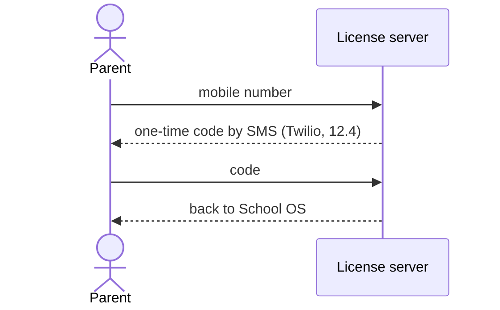

**F14.1 — Sign in with a mobile code** · Parent · screen: [Parent sign-in with a mobile code](system-map.html#screen/future-parent)

- **What happens:** Scope only: parents enter their mobile number and a one-time SMS code. SMS through Twilio is the very last stage.
- **Frontend:** —
- **Backend:** —
- **License server:** LS-8 (moved to 12.4)
- **Data:** LS `outbound_messages` (SMS, TWILIO)
- **Phase:** 12.4
- **Today:** Not built; until then parents use mobile + password.

### F15 — Sign out

**Who:** Everyone · **Phases:** Built · 4.1 · LS-1 · [Walk it with mock screens](system-map.html#flows/F15/1)

Today the backend clears its cookies; when finished, both the School OS session and the license-server session end.

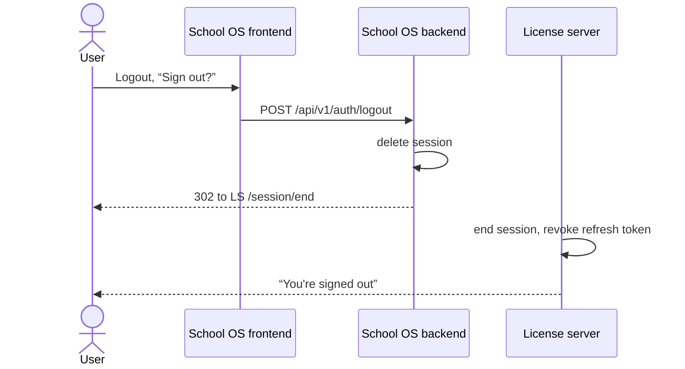

**F15.1 — Sign out** · User · screen: [Dashboard](system-map.html#screen/sos-dashboard/today/sos-logout) (with its dialog open)

- **What happens:** The sidebar Logout asks “Sign out?”. Today it calls the backend, clears the SPA state and opens the login page.
- **Frontend:** `frontend/src/components/app-sidebar.tsx`, `frontend/src/hooks/auth/useAuth.ts` (`useLogout`)
- **Backend:** today `POST /api/auth/logout` → `authService.logoutUser`; target `POST /api/v1/auth/logout` (4.1)
- **License server:** —
- **Data:** —
- **Phase:** Built · 4.1
- **Today:** Works from the sidebar; the profile drawer's Sign Out does nothing.

**F15.2 — Both sessions end** · Backend + license server (automatic) · screen: [End both sessions](system-map.html#screen/sys-signout)

- **What happens:** Target: the backend deletes its session and redirects to the license server's end-session URL, which ends that session and revokes the refresh token.
- **Frontend:** —
- **Backend:** `POST /api/v1/auth/logout` (4.1)
- **License server:** `GET /session/end` (registered post-logout redirect)
- **Data:** backend `sessions`; LS `oidc_payloads` (session ended, refresh token revoked)
- **Phase:** 4.1 · LS-1
- **Today:** Not built.

**F15.3 — Signed out** · User · screen: [Signed out](system-map.html#screen/ls-signedout)

- **What happens:** “You're signed out.”
- **Frontend:** —
- **Backend:** —
- **License server:** end-session page
- **Data:** —
- **Phase:** LS-2
- **Today:** Today you land on the School OS login form.

---

## 5. Module map

### Modules that exist or are specified

#### Authentication (today) — built today

- **Screens:** [Login (today)](system-map.html#screen/sos-login)
- **Endpoints:** `POST /api/auth/login` · `POST /api/auth/refresh` · `POST /api/auth/logout` · `GET /api/auth/me` · `POST /api/auth/register` · `POST /api/auth/forgot-password` · `POST /api/auth/reset-password/:token` · `GET /api/auth/verify-reset-token/:token`
- **Permissions:** —
- **Tables:** `users`, `user_has_roles`, `role_has_permissions`, `user_has_permissions`
- **Phase:** Replaced by the license server · 4.1 / 4.2 / 4.8

#### Dashboard — built today

- **Screens:** [Dashboard](system-map.html#screen/sos-dashboard)
- **Endpoints:** none (mock data)
- **Permissions:** —
- **Tables:** —
- **Phase:** 6.16 (real data)

#### Users — built today

- **Screens:** [IAM](system-map.html#screen/sos-iam)
- **Endpoints:** `GET` / `POST /api/users` · `GET` / `PUT` / `DELETE /api/users/:id` · `POST /api/users/status-change/:id` · `PUT /api/users/profile` · `POST /api/users/change-password` · `POST /api/users/validate-import` · `POST /api/users/import`
- **Permissions:** `users.view` · `users.create` · `users.edit` · `users.delete`
- **Tables:** `users`
- **Phase:** 4.4

#### Roles and permissions — built today

- **Screens:** [IAM](system-map.html#screen/sos-iam), [Role permissions](system-map.html#screen/sos-iam-role-perms), [User role and permissions](system-map.html#screen/sos-iam-user-perms)
- **Endpoints:** `/api/iam/roles` (`GET`, `POST`, `GET /assignable`, `GET` / `PUT` / `DELETE /:id`) · `/api/iam/permissions` (`GET`, `POST`, `GET /actions`, `GET` / `PUT` / `DELETE /:id`) · `/api/iam/roles/:roleId/permissions` (`GET`, `POST`, `POST /sync`, `DELETE /:permissionId`) · `/api/iam/users/:userId/roles` (`GET`, `POST`, `POST /sync`, `DELETE /:roleId`) · `/api/iam/users/:userId/permissions` (`GET`, `POST`, `POST /sync`, `DELETE /:permissionId`)
- **Permissions:** `roles.*` · `permissions.*` · `user-role.*` · `user-permission.*` (the seeded `role-permission.*` guard nothing)
- **Tables:** `roles`, `permissions`, `role_has_permissions`, `user_has_roles`, `user_has_permissions`
- **Phase:** 4.3 · 4.4

#### Organizations — built today

- **Screens:** [Organizations](system-map.html#screen/sos-org-list), [Add school](system-map.html#screen/sos-org-create), [School details](system-map.html#screen/sos-org-detail), [Edit school](system-map.html#screen/sos-org-edit)
- **Endpoints:** `GET` / `POST /api/organizations` · `GET` / `PATCH /api/organizations/:organizationId`
- **Permissions:** `organizations.view` · `organizations.create` · `organizations.edit`
- **Tables:** `organizations`
- **Phase:** 5.1 · 6.1

#### Branches — built today

- **Screens:** [Branches](system-map.html#screen/sos-branches)
- **Endpoints:** `GET` / `POST /api/organizations/:organizationId/branches` · `GET` / `PATCH` / `DELETE .../branches/:branchId`
- **Permissions:** `branches.view` · `branches.create` · `branches.edit` · `branches.delete`
- **Tables:** `branches`
- **Phase:** 5.2 · 6.2

#### Staff and designations — built today

- **Screens:** [Staff](system-map.html#screen/sos-staff)
- **Endpoints:** `GET` / `POST .../staff` · `GET` / `PATCH .../staff/:staffId` · `GET` / `POST .../staff/designations` · `PATCH .../staff/designations/:designationId`
- **Permissions:** `staff.view` · `staff.create` · `staff.edit`
- **Tables:** `staff`, `designations`
- **Phase:** 5.3 · 5.4 · 6.3 · 6.4

#### Students — built today

- **Screens:** [Students](system-map.html#screen/sos-students)
- **Endpoints:** `GET` / `POST .../students` · `GET` / `PATCH .../students/:studentId` · `POST .../students/enroll`
- **Permissions:** `students.view` · `students.create` · `students.edit`
- **Tables:** `students`, `student_academic_enrollments`
- **Phase:** 5.6 · 5.13 · 6.6 · 6.13

#### Academics — built today

- **Screens:** [Academics](system-map.html#screen/sos-academics)
- **Endpoints:** `.../academics/years` (`GET`, `POST`, `PATCH /:yearId`) · `.../classes` (`GET`, `POST`, `PATCH /:classId`) · `.../classes/:classId/sections` (`POST`, `PATCH /:sectionId`) · `.../subjects` (`GET`, `POST`, `PATCH /:subjectId`) · `.../assignments/class-teachers` and `.../assignments/subject-teachers` (`GET`, `POST`) · `.../exams` (`GET`, `POST`, `PATCH /:examId`) · `.../marks` (`GET`, `POST`)
- **Permissions:** `academics.view` · `academics.create` · `academics.edit`
- **Tables:** `academic_years`, `classes`, `sections`, `subjects`, `class_subjects`, `class_teacher_assignments`, `subject_teacher_assignments`, `exams`, `exam_subjects`, `marks`
- **Phase:** 5.8–5.15 · 6.8–6.15

#### Self-service sign-up and trial — specified

- **Screens:** [Start a free trial (/signup)](system-map.html#screen/sos-signup), [Dashboard](system-map.html#screen/sos-dashboard), [Renewal page](system-map.html#screen/sos-renewal)
- **Endpoints:** target `POST /api/v1/public/school-signups`
- **Permissions:** public (rate-limited)
- **Tables:** backend `organizations`, `users`, `user_has_roles`; LS `tenants`, `tenant_licenses`
- **Phase:** 5.16 · 6.18 · LS-4 · LS-5

#### Invitations — specified

- **Screens:** [School details](system-map.html#screen/sos-org-detail), [Staff](system-map.html#screen/sos-staff)
- **Endpoints:** target invitation endpoints (5.7) calling `POST /admin/v1/identities` and `POST /admin/v1/tenants/:publicId/users`
- **Permissions:** set in the 5.7 spec
- **Tables:** `invitations`
- **Phase:** 2.2 · 5.7 · 6.7

#### License server — specified

- **Screens:** [Sign in](system-map.html#screen/ls-signin), [Two-step code](system-map.html#screen/ls-2fa-code), [Two-step setup](system-map.html#screen/ls-2fa-setup), [Forgot password](system-map.html#screen/ls-forgot), [Reset password](system-map.html#screen/ls-reset), [Set password](system-map.html#screen/ls-setpw), [All set](system-map.html#screen/ls-done), [School access inactive](system-map.html#screen/ls-inactive), [Signed out](system-map.html#screen/ls-signedout), [Dev inbox](system-map.html#screen/ls-inbox), [Schools](system-map.html#screen/ls-adm-schools), [School detail](system-map.html#screen/ls-adm-school), [Plans](system-map.html#screen/ls-adm-plans), [Licences](system-map.html#screen/ls-adm-licences), [Platform staff](system-map.html#screen/ls-adm-staff), [Audit log](system-map.html#screen/ls-adm-audit)
- **Endpoints:** OIDC endpoints, hosted pages, `/admin`, `/dev/inbox`, `/admin/v1/*` (`license-server/docs/api.md`)
- **Permissions:** plane PLATFORM + `can_manage_licenses` for `/admin`
- **Tables:** the 14 license-server tables
- **Phase:** LS-1 … LS-7

### Future modules (scope only, no screens drawn)

| Module | Phase | Scope | Tables |
|---|---|---|---|
| Departments | 5.3 · 6.3 | Departments next to designations. | `departments` |
| Staff ↔ branch assignments | 5.4 · 6.4 | A staff member can work in several branches. | `staff_branch_assignments` |
| Guardians | 5.5 · 6.5 | Parents and guardians, linked to students. | `guardians`, `student_guardians` |
| Grade levels | 5.9 · 6.9 | Grade levels; a class is a grade in a branch for a year. | `grade_levels` |
| Sections screen | 5.10 · 6.10 | Sections exist in the API today but have no screen. | `sections` |
| Class subjects | 5.11 · 6.11 | Which subjects each class takes (service exists, not routed). | `class_subjects` |
| Teaching assignments | 5.12 · 6.12 | Class teachers and subject teachers in one table; fixes B9. | `teaching_assignments` |
| Enrollments | 5.13 · 6.13 | Students enrolled in a class for a year. | `enrollments` |
| Exam subjects | 5.14 · 6.14 | Subjects, dates and maximum marks per exam. | `exam_subjects` |
| Marks, publication, corrections | 5.15 · 6.15 | Marks entry, publishing results, audited corrections. | `marks`, `mark_corrections` |
| Platform namespace and support sessions | 4.5 | Platform operations under `/api/v1/platform`; support staff act inside a school only through a support session. | `support_sessions` |
| Audit log (School OS) | 4.4 | Every grant, status change and correction written to `audit_logs` (the table exists since 2.1). | `audit_logs` |
| Parent portal with mobile code | 12.4 (LS-8) | Parents sign in with a one-time SMS code. | LS `outbound_messages` |

### In today's sidebar but not in the roadmap — [DECIDE]

| Item | Today |
|---|---|
| Teachers | Sidebar link to `/teachers` (no route). Staff exist under each school; a separate Teachers page is not in the roadmap. |
| Class schedules | Sidebar link to `/class-schedules` (no route); no timetable module in the roadmap. |
| Fee management | Sidebar link to `/fee-management` (no route); no fees module in the roadmap. |
| System logs | Sidebar link to `/system-logs` with a hard-coded badge; no screen planned (the audit log is backend-only in 4.4). |
| Settings | Sidebar link to `/settings` (no route); only the theme drawer works today. |
| Help | Sidebar link to `/help` (no route). |
| User permissions | Sidebar link to `/user-permissions` (no route); the real page is `/iam/users/:id/permissions`. |

### Screens in `system-map.html`

| Screen | Where | Status | Phase |
|---|---|---|---|
| [Sign in](system-map.html#screen/ls-signin) | License server · sign-in pages | Proposal | LS-1 plain · LS-2 final |
| [Two-step code](system-map.html#screen/ls-2fa-code) | License server · sign-in pages | Proposal | LS-3 |
| [Two-step setup](system-map.html#screen/ls-2fa-setup) | License server · sign-in pages | Proposal | LS-3 |
| [Forgot password](system-map.html#screen/ls-forgot) | License server · sign-in pages | Proposal | LS-3 |
| [Reset password](system-map.html#screen/ls-reset) | License server · sign-in pages | Proposal | LS-3 |
| [Set password](system-map.html#screen/ls-setpw) | License server · sign-in pages | Proposal | LS-2 · LS-3 |
| [All set](system-map.html#screen/ls-done) | License server · sign-in pages | Proposal | LS-2 |
| [School access inactive](system-map.html#screen/ls-inactive) | License server · sign-in pages | Proposal | LS-2 · LS-4 |
| [Signed out](system-map.html#screen/ls-signedout) | License server · sign-in pages | Proposal | LS-1 · LS-2 |
| [Dev inbox](system-map.html#screen/ls-inbox) | License server · dev inbox | Proposal | LS-3 |
| [Schools](system-map.html#screen/ls-adm-schools) | License server · admin UI | Proposal | LS-7 |
| [School detail](system-map.html#screen/ls-adm-school) | License server · admin UI | Proposal | LS-7 |
| [Plans](system-map.html#screen/ls-adm-plans) | License server · admin UI | Proposal | LS-4 · LS-7 |
| [Licences](system-map.html#screen/ls-adm-licences) | License server · admin UI | Proposal | LS-4 · LS-7 |
| [Platform staff](system-map.html#screen/ls-adm-staff) | License server · admin UI | Proposal | LS-7 |
| [Audit log](system-map.html#screen/ls-adm-audit) | License server · admin UI | Proposal | LS-7 |
| [Start a free trial (/signup)](system-map.html#screen/sos-signup) | School OS · public | Proposal | 6.18 · 5.16 |
| [Login (today)](system-map.html#screen/sos-login) | School OS · sign-in and home | Built, changes planned | Built · replaced in 4.8 |
| [Dashboard](system-map.html#screen/sos-dashboard) | School OS · sign-in and home | Built, changes planned | Built · real data in 6.16 |
| [Renewal page](system-map.html#screen/sos-renewal) | School OS · sign-in and home | Proposal | 6.18 |
| [Organizations](system-map.html#screen/sos-org-list) | School OS · organizations | Built, changes planned | Built · 5.1 / 6.1 |
| [Add school](system-map.html#screen/sos-org-create) | School OS · organizations | Built, changes planned | Built · 5.1 / 6.1 |
| [School details](system-map.html#screen/sos-org-detail) | School OS · organizations | Built, changes planned | Built · 5.1 / 5.7 / 6.1 / 6.7 |
| [Edit school](system-map.html#screen/sos-org-edit) | School OS · organizations | Built, changes planned | Built · fix in 6.0 |
| [Branches](system-map.html#screen/sos-branches) | School OS · organizations | Built, changes planned | Built · 5.2 / 6.2 · limit 5.16 |
| [Staff](system-map.html#screen/sos-staff) | School OS · people | Built, changes planned | Built · 5.3 / 5.4 / 5.7 / 6.x |
| [Students](system-map.html#screen/sos-students) | School OS · people | Built, changes planned | Built · 5.6 / 5.13 / 6.6 · limit 5.16 |
| [Academics](system-map.html#screen/sos-academics) | School OS · academics | Built, changes planned | Built · 5.8–5.15 / 6.8–6.15 |
| [IAM](system-map.html#screen/sos-iam) | School OS · roles and permissions | Built, changes planned | Built · 4.4 |
| [Role permissions](system-map.html#screen/sos-iam-role-perms) | School OS · roles and permissions | Built, changes planned | Built · 4.4 |
| [User role and permissions](system-map.html#screen/sos-iam-user-perms) | School OS · roles and permissions | Built, changes planned | Built · 4.4 |
| [Error pages](system-map.html#screen/sos-error) | School OS · errors | Built today | Built · 403 used from 4.8 |
| [Seed the platform admin](system-map.html#screen/sys-seed) | Behind the scenes | Behind the scenes | LS-1 |
| [Redirect to the license server](system-map.html#screen/sys-oidc-start) | Behind the scenes | Behind the scenes | 4.1 · LS-1 |
| [Callback and session](system-map.html#screen/sys-oidc-callback) | Behind the scenes | Behind the scenes | 4.1 · 2.2 · LS-1 |
| [Register a school (admin API)](system-map.html#screen/sys-provision-tenant) | Behind the scenes | Behind the scenes | 5.1 · LS-5 |
| [Provision a person (admin API)](system-map.html#screen/sys-provision-identity) | Behind the scenes | Behind the scenes | 5.7 · LS-5 |
| [Self-service sign-up calls](system-map.html#screen/sys-signup) | Behind the scenes | Behind the scenes | 5.16 · LS-5 |
| [Status and licence webhook](system-map.html#screen/sys-webhook) | Behind the scenes | Behind the scenes | 4.6 · LS-5 |
| [Daily licence check](system-map.html#screen/sys-daily-job) | Behind the scenes | Behind the scenes | LS-4 |
| [A permission change takes effect](system-map.html#screen/sys-access-version) | Behind the scenes | Behind the scenes | 4.3 · 4.4 |
| [End both sessions](system-map.html#screen/sys-signout) | Behind the scenes | Behind the scenes | 4.1 · LS-1 |
| [Marks entry, publication and corrections](system-map.html#screen/future-marks) | Future modules | Future scope | 5.14 · 5.15 · 6.14 · 6.15 |
| [Parent sign-in with a mobile code](system-map.html#screen/future-parent) | Future modules | Future scope | 12.4 (LS-8) |

---

## 6. Known issues in today's code

Confirmed by reading the code on `main`; none has been reproduced at runtime. **B** numbers are already recorded in
`backend/docs/current-state.md` and `frontend/docs/current-state.md`; **N** numbers were found on 2026-09-30 while
writing this roadmap. None is fixed by this document: each is fixed in the phase shown.

| ID | Issue | Where | Fixed in |
|---|---|---|---|
| B1 | Edits are sent as PUT but the school modules expect PATCH, so 8 edit screens get 404 | `frontend/src/services/axios-instance.ts:120-121`; `backend/src/routes/*.routes.ts` | 6.0 |
| B2 | `.env.example` base URL lacks `/api` and uses another port | `frontend/.env.example:1` | 6.0 |
| B3 | Organization summary counts always show 0 (the hook drops `summary`) | `frontend/src/hooks/organization/useOrganization.ts:21,35` | 6.1 |
| B4 | A 401 on `/auth/me` never refreshes, so sign-in can loop between login and dashboard | `frontend/src/routes/PrivateRouter.tsx:33-49`, `frontend/src/routes/PublicRouter.tsx:6-7` | 4.8 |
| B5 | JWT expiry units (ms vs s) | `backend/src/config/appConfig.ts`, `backend/src/helpers/token.ts` | removed with in-app JWT (LS-1, 4.1) |
| B6 | Organization-scoped roles never grant anything | `backend/src/middleware/authorize.middleware.ts`, `backend/src/services/authorization.service.ts` | 4.3 |
| B7 | Users created without a user id by register and import | `backend/src/services/auth.service.ts`, `backend/src/services/user.service.ts` | 4.2 (register removed); import: set in the 4.4 spec |
| B8 | Permissions created in the UI get `resource:action`, seeded ones `resource.action`, so UI checks never match them | `backend/src/services/permission.service.ts:33`, `backend/src/database/seeders/PermissionSeeder.ts:12` | 4.4 |
| B9 | Re-assigning a class teacher hits a unique index | `backend/src/services/academic.service.ts` | 5.12 |
| B10 | User role sync wipes organization-scoped assignments | `backend/src/services/userRole.service.ts:66-75` | 4.4 |
| B11 | The user-permissions page keeps one role only and cannot set deny | `frontend/src/pages/system/iam/user-permissions/page.tsx`, `frontend/src/hooks/iam/useIam.ts:170` | 4.4 + IAM screens [DECIDE sub-phase] |
| B12 | 8 of 11 sidebar links (and 4 Students sub-links) have no route and land on 404 | `frontend/src/components/app-sidebar.tsx:24-45` | 6.17 |
| B13 | Password reset and welcome emails are never sent | `backend/src/config/bootstrap.ts` | moved to the license server (LS-3); removed in 4.2 |
| N1 | `GET /api/users` hides every user who holds a system role, so Admin users vanish from IAM and from the staff picker | `backend/src/services/user.service.ts:45-46` | 4.4 [DECIDE intended behaviour] |
| N2 | User role sync also deletes the hidden Super Admin assignment | `backend/src/services/userRole.service.ts:69` | 4.4 |
| N3 | Saving direct permissions turns existing denies into allows | `frontend/src/hooks/iam/useIam.ts:170`, `backend/src/services/userPermission.service.ts:23` | 4.4 + IAM screens |
| N4 | After logging out and in again in the same tab, roles and permissions stay empty until a reload | `frontend/src/store/auth/authSlice.ts:66-77`, `frontend/src/routes/PrivateRouter.tsx:38` | 4.8 |
| N5 | UI and backend validation disagree (password 6 vs 8 characters, name length, academic-year dates optional in the UI but required columns) | `frontend/src/pages/system/iam/components/UsersTab.tsx`, `backend/src/validators/user.schema.ts`, `backend/prisma/schema.prisma` | 3.2 + each 6.n |
| N6 | No route-level permission guards; any signed-in user can open `/iam` or any school page by URL | `frontend/src/routes/PrivateRouter.tsx` | 4.8 · 6.0 |
| N7 | Only Super Admin can run schools: the seeded Admin role has IAM permissions only, and School Admin, Branch Admin, Teacher, Accountant and HR have none | `backend/src/database/seeders/RolePermissionSeeder.ts:3-15` | 4.4 (role mappings from design §11) |
| N8 | Student edit sends empty strings, including an invalid empty gender | `frontend/src/pages/organization/students/student-list-page.tsx` | 6.6 |
| N9 | The frontend `changePassword` omits the `confirmPassword` the backend requires (unused today) | `frontend/src/services/user-service.ts` | 4.2 (passwords move to the license server) |
| N10 | Dashboard, header profile, search and year selector are mock data; the header's Sign Out does nothing | `frontend/src/pages/dashboard/page.tsx`, `frontend/src/components/site-header.tsx` | 6.16 · 6.17 |
| N11 | CSRF middleware not mounted and the frontend never sends `X-XSRF-TOKEN` | `backend/src/middleware/csrf.middleware.ts` | 4.1 · 6.0 |

---

## 7. Decisions and open questions

### Owner decisions (all 2026-09-30)

| # | Question | Answer | Effect |
|---|---|---|---|
| 1 | Is `dev` deployed beyond local? | No | Phase 1.5 dropped |
| 2 | Google/Microsoft sign-in? | Not needed | OAuth removed (4.2) |
| 3 | Authentication approach | Custom license server, a separate app for identity + licences, OIDC via `oidc-provider`, School OS only | ADR-005, Phase LS |
| 4 | Repositories (first answer) | Superseded by #5 | — |
| 5 | Repositories | One repository `subashrs31/School-OS` with `backend/`, `frontend/`, `license-server/`; fresh history | ADR-006 |
| 6 | ADR-001…005 | Approved | Accepted |
| 7 | Sign-in identifier | Email or mobile + password; no login codes | LS-1 |
| 8 | Who manages plans and licences | A small admin UI in the license server | LS-7 |
| 9 | Self-service school sign-up | Yes: page in School OS; trial starts after the admin confirms and sets a password; 7 days; all features; 1 branch / 100 students / 20 staff (editable) | ADR-007, 5.16, 6.18, LS-4, LS-5 |
| 10 | Parents | Mobile one-time-code sign-in | LS-8, moved to 12.4 by #12 |
| 11 | Target for now | A fully working app that runs locally | Phase 10 moved to Phase 12 |
| 12 | SMS / Twilio | The last stage of the last phase; until then SMS codes go to the dev inbox | 12.4 |
| 13 | Local message delivery | The license-server dev inbox (`/dev/inbox`, local only) | LS-3 |
| 14 | Where platform staff create a school | In School OS; School OS registers it with the license server (ADR-005/007 unchanged) | F3 |
| 15 | Mock screens | Full screens only for built and specified modules; future modules as scope cards | `system-map.html` |
| 16 | Build order | Build and test the whole license server first (LS track), with a clickable mockup before its UI; add a Platform staff screen | Phase LS, LS-7 |
| 17 | LS-1 dependencies | `oidc-provider` 9.12.2, `argon2` 0.45.1, Prisma 7.10 + `@prisma/adapter-pg` 7.10.0 + `pg` 8.23.0 approved | LS-1 |
| 18 | 2.1 approach | Staged, additive, camelCase columns | 2.1 |
| 19 | Branching | Work directly on `main` for now | — |

### Open questions — [DECIDE]

| Question | Phase | Note |
|---|---|---|
| Hosting target | 12.2 | Not needed until the end. |
| Payment provider | not scheduled | Until then platform staff upgrade schools in the admin UI. |
| Can a closed school be reopened? | LS-7 · 5.1 | The mockup assumes closing is final. |
| Platform-staff rules | LS-7 | Proposed: only staff who can manage licences open the admin UI; nobody can disable themselves or remove their own access; the last person with access can't be disabled or lose it. |
| Starting status of a school added by platform staff | 5.1 · 4.6 · LS-5 | Design §3.1 keeps it PENDING until the first admin finishes setup; the licence mapping makes it ACTIVE when a licence starts. Settle which wins. |
| How a platform identity gets its School OS platform role (Super Admin or Admin) | 4.5 | Not described in the specs yet. |
| Licence reminder timing | LS-4 · LS-5 | How many days before the end the reminder and `license.expiring` go out. |
| Password rules | LS-3 | Length and other rules. |
| Support contact shown on sign-in and reminder pages | LS-2 | Email or phone to show. |
| Teacher and other school-role permissions | 4.4 | The role mappings (design §11) are not in the repository yet; the seeded school roles have no permissions. |
| IAM screen fixes (B11, N3) | 4.4 + ? | No frontend sub-phase covers the IAM screens yet. |
| Sidebar items with no phase | 6.17 | Teachers, Class schedules, Fee management, System logs, Settings, Help: plan, hide or remove. |
| `target-architecture.md` status | Phase 1 | Still marked Proposed although its ADRs are accepted. |
| Paid plans | LS-7 | Names, prices, currency, billing period, grace days, limits — you enter them in the admin UI when ready. |
