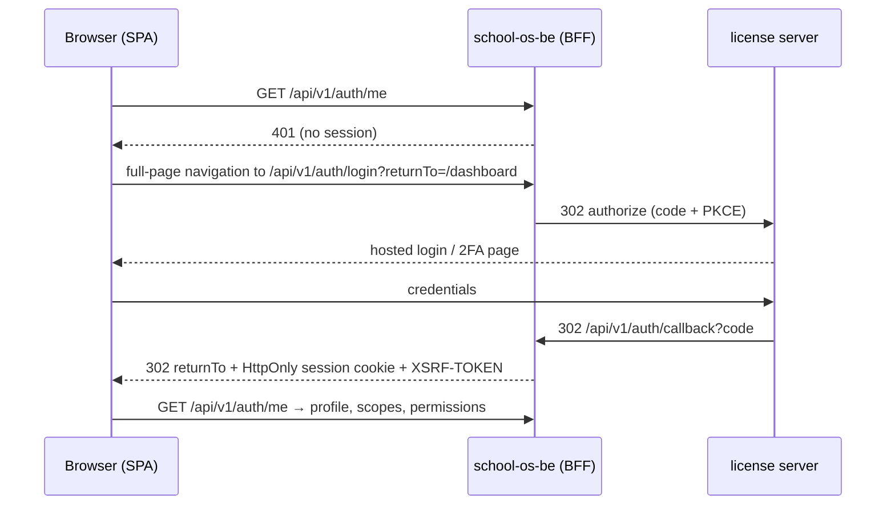

# school-os-fe — Target Architecture (Proposed)

> Status: **Proposed — awaiting approval.** Cross-cutting decisions are ADRs in the backend repo:
> `school-os-be/docs/architecture/` — ADR-003 (tenant scoping), ADR-004 (testing), ADR-005 (license server / OIDC).
> System view: `school-os-be/docs/target-architecture.md`.

## 1. Sign-in (ADR-005)

- The SPA has **no login form and no tokens**. The `/auth/login` route becomes a redirect to `/api/v1/auth/login`.
- The `isLoggedIn` cookie, `useTokenRefresh`, the refresh queue in the axios interceptor and `auth-session.ts` token
  helpers are removed; session state = result of `/auth/me`. This removes bug B4 by construction.
- Sign out: `POST /api/v1/auth/logout` → the backend clears the session and redirects to the license server's end-session URL.
- Forgot/reset password, 2FA and invitation set-password pages are hosted by the license server.

## 2. Structure

`src/features/<module>/{api,hooks,components,pages,types}` for organizations, branches, people, academics, exams, iam,
auth. Existing folders move into features **as each module is rebuilt** (Phase 6), not in a separate reshuffle.

## 3. Rules

| Area | Target |
|---|---|
| Types | API/entity types per feature, matching the backend OpenAPI contract; no new `any`; `strict` enabled per feature folder, then globally |
| Server state | TanStack Query only; query keys per feature; server-side pagination/search with debounced input |
| Client state | Redux only for session (from `/auth/me`) and UI preferences; one theme source |
| HTTP | `PATCH` for partial updates (fixes B1); `X-XSRF-TOKEN` on mutations; 401 → redirect to `/api/v1/auth/login` |
| Routing | `<RequirePermission>` guard + `errorElement` on every route; `/403` used |
| Tenancy | Org/branch switcher driven by scopes from `/auth/me`; active org stays in the URL |
| Sidebar | Items rendered from route config and permissions; no links without routes (fixes B12) |
| Errors | Every page renders loading, empty, error and success states |
| Performance | Dashboard on real, paginated data; heavy libraries only in their route chunk; one toast library; one font family |
| UI changes | Requirements → responsive mockup → **owner approval** → implementation (master prompt §27) |

## 4. Testing (ADR-004)

- Vitest + Testing Library for hooks/components.
- Playwright + playwright-bdd in `e2e/`: `.feature` files from `docs/bdd`, page objects in `e2e/pages`, steps in
  `e2e/steps`. Authentication setup signs in once through the license server and saves storage state; dedicated
  specs cover login, logout, session expiry and inactive tenant.
- Chromium on every PR; Firefox, WebKit and one mobile viewport nightly.

## 5. Environment

| Variable | Meaning |
|---|---|
| `VITE_API_BASE_URL` | replaces `VITE_REACT_CLIENT_URL`; must end in `/api/v1/` (fixes B2) |
| `VITE_PUBLIC_PATH` | unchanged |
