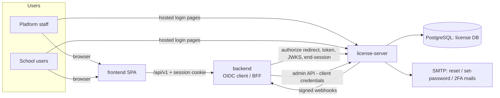

# License server — Architecture

> Decision record: [ADR-005](../../backend/docs/architecture/ADR-005-license-server-oidc.md). This document details it.
> Status: **Accepted** with ADR-005 and ADR-007 (owner, 2026-09-30). Implementation starts with LS-0.

## 1. Context



- One tenant = one school (School OS only). Tenant id is shared with the backend as `organizations.public_id`.
- The license server knows **who may sign in** and **whether a school is licensed**. It does not know school roles.

## 2. Components

```text
src/
├── server.ts, app.ts           Express app; mounts oidc-provider under /
├── oidc/
│   ├── provider.ts             Provider config (features, TTLs, claims, clients, jwks, cookies)
│   ├── adapter.ts              Prisma adapter for oidc-provider models (sessions, grants, codes, refresh tokens)
│   ├── account.ts              findAccount(): loads identity, builds claims
│   └── interactions/           Express routes for login, 2FA, consent-free first-party flow
├── modules/
│   ├── identities/             credentials, lockout, password reset, 2FA
│   ├── tenants/                tenants, tenant users, sign-in eligibility
│   ├── licenses/               plans (incl. the trial plan), features, licenses, entitlements, expiry job
│   ├── signups/                self-service school sign-up: tenant + identity + trial in one call (ADR-007)
│   ├── admin-api/              /admin/v1 for the backend (client credentials)
│   ├── admin-ui/               platform-staff UI: tenants, plans, licenses, suspensions, audit (LS-7)
│   ├── messages/               outgoing email/SMS: transports dev-inbox (local default) · smtp (MAIL_*) · twilio (12.4)
│   └── webhooks/               outbox, signing, delivery with retries
├── views/                      server-rendered hosted pages and admin UI pages (see §6)
└── lib/                        prisma, logger, crypto, mailer
```

## 3. OIDC configuration (`oidc-provider` 9.12.x)

| Setting | Value | Why |
|---|---|---|
| Issuer | `LS_ISSUER` env, e.g. `https://auth.<domain>` | Stable `iss` checked by the backend |
| Clients | `school-os-backend`: confidential, `client_secret_basic`, grant types `authorization_code`, `refresh_token`, `client_credentials`; redirect URI `…/api/v1/auth/callback`; post-logout URI `…/` | BFF + admin API use the same registered client, different grants |
| PKCE | required (S256) for every authorization-code request | Defence in depth even for the confidential client |
| Scopes | `openid`, `profile`, `email`, `offline_access`; admin scopes `identities:provision`, `tenants:manage`, `licenses:read`, `signups:create` | Admin scopes only via `client_credentials` |
| Resource indicators | resource `school-os-api` → access token format **JWT**, RS256, audience `school-os-api` | Lets backend verify locally |
| Access token TTL | 10 min | Short; BFF refreshes server-side |
| Refresh token | rotating, TTL 7 days idle / 30 days absolute; reuse revokes the whole grant | Theft detection |
| ID token claims | `sub`, `name`, `email`, `email_verified`, `amr`, `auth_time` | Standard |
| Access token extra claims | `plane` (`platform`/`school`), `av` (identity version) | the backend needs the plane; `av` invalidates tokens after password change/lockout |
| Features enabled | `resourceIndicators`, `clientCredentials`, `revocation`, `rpInitiatedLogout` | Only what the flows need |
| Features disabled | dynamic registration, device flow, introspection (JWT verified locally) | Smaller attack surface |
| Consent | skipped for first-party client (grant created programmatically in the interaction) | Single first-party product |
| Keys | RS256 signing keys loaded from secret storage as JWKS; two active (current + next) for rotation; never in the database | Rotation without downtime |
| Cookies | `LS_COOKIE_KEYS` (rotating list), `SameSite=Lax`, `Secure` outside local | oidc-provider session/interaction cookies |

## 4. Sign-in eligibility

Checked in the login interaction after credentials (and 2FA) succeed, and again on every refresh:

| Rule | Result if violated |
|---|---|
| Identity `status = ACTIVE` and not locked | sign-in refused, generic message |
| Plane `platform` → always eligible (still needs 2FA) | — |
| Plane `school` → at least one `tenant_users` row `ACTIVE` whose tenant is `ACTIVE` with a licence in `TRIAL/ACTIVE/GRACE` | refused with "your school's access is inactive"; school admins of an INACTIVE tenant are allowed in so they can see the renew page (design §3.1) |
| `av` in the refresh token older than identity `access_version` | refresh refused → user must sign in again |
| Admin UI (LS-7): plane `platform` **and** `can_manage_licenses` (ADR-007 D8) | admin UI refused; normal sign-in unaffected |

Identifier: sign-in is by **email or mobile** + password (owner, 2026-09-30); there are no login codes. Parents will also
be able to sign in with a one-time code sent to their mobile (LS-8).

Per-school access for a user who belongs to several schools is enforced by the backend using `organizations.status`,
which this service keeps in sync through webhooks.

## 5. Integration contracts with the backend

| Direction | Mechanism | Detail in |
|---|---|---|
| BE → LS sign-in | OIDC authorization code + PKCE, token endpoint | `api.md` §1 |
| BE verifies tokens | JWKS at `/jwks`, cached; refetch on unknown `kid` | `api.md` §1 |
| BE → LS provisioning | `/admin/v1/*` with client-credentials token | `api.md` §2 |
| LS → BE status | HMAC-signed webhooks from an outbox, retried | `api.md` §3 |
| BE → LS reconciliation | `GET /admin/v1/tenants?updatedSince=` daily | `api.md` §2 |

## 6. Hosted pages

Login (email or mobile + password), 2FA code, forgot password, reset password, set password (from an invitation or a
self-service sign-up — the same page also verifies the email/mobile, ADR-007), signed out, "school access inactive",
and later the mobile one-time-code sign-in for parents (LS-8). Server-rendered, no SPA framework, same visual language
as the frontend (shared colour tokens). **Mockups require owner approval before implementation (LS-2).** Pages are
covered by Playwright.

**Admin UI (LS-7)** — a small server-rendered UI for platform staff, at `/admin` on the license server:

| Screen | What it does |
|---|---|
| Tenants | list and search schools; status, licence, sign-up source |
| Tenant detail | suspend / unsuspend / close with a reason; see its admins; licence history |
| Plans | create and edit plans, including the trial plan (length, grace days, limits) |
| Licences | assign or change a plan, renew, extend or cancel a licence |
| Audit | read-only view of `ls_audit_logs` |

Access: platform identities with `can_manage_licenses` (ADR-007 D8), 2FA required, every change audited and
announced to the backend by webhook. **Mockups require owner approval before implementation.**

**Local dev inbox** (owner decision 2026-09-30 — the app runs locally for now, and Twilio comes last, in 12.4):
every email or SMS the service would send (set-password and reset links, verification codes, licence reminders) is
stored in `outbound_messages` and shown at `GET /dev/inbox`, newest first, with clickable links and visible codes.

| Setting | Values | Default |
|---|---|---|
| `LS_MAIL_TRANSPORT` | `dev-inbox` · `smtp` (uses `MAIL_*`) | `dev-inbox` |
| `LS_SMS_TRANSPORT` | `dev-inbox` · `twilio` (12.4) | `dev-inbox` |

The inbox page and its route exist only when `LS_ENV=local`; in any other environment the route is not registered at
all, and startup fails if a `dev-inbox` transport is configured there.

## 7. Security

- Passwords: Argon2id (library chosen and approved in LS-3), per-identity lockout after 5 failures for 15 min plus
  IP rate limiting; password reset tokens stored as SHA-256 hashes, single use, 15 min; forgot-password always 200.
- 2FA: TOTP, secret encrypted at rest (AES-256-GCM, key from secret storage); hashed recovery codes; required for
  plane `platform` and for school admins (role flag supplied by the backend at provisioning).
- Admin API: client-credentials only, scope-checked per route, rate limited, every call in `ls_audit_logs`.
- Webhooks: HMAC-SHA256 over `timestamp.body`, 5-minute replay window, unique event id.
- No secrets in logs; request id propagated (`X-Request-Id`) to backend calls.

## 8. Deployment

Own container and own PostgreSQL database; must be reachable by browsers (hosted pages) and by backend.
Local: the owner's PostgreSQL 18 (databases `license_server` and `license_server_test`, already created); a root
`docker-compose.yml` is planned for Phase 10. Backups separate from the school database. Hosting target:
**UNKNOWN — REQUIRES CONFIRMATION** (same answer as the backend).

## 9. Open questions

1. ~~Login identifier~~ — **answered 2026-09-30:** email or mobile + password; no login codes.
2. ~~Who manages plans and licenses~~ — **answered 2026-09-30:** a small admin UI in this service (LS-7).
3. Payment provider integration — out of scope until chosen.
4. ~~SMS provider~~ — **answered 2026-09-30:** Twilio, in the last stage (12.4); until then SMS goes to the dev inbox.
5. ~~ADR-007 defaults D1–D8~~ — **accepted 2026-09-30.**
